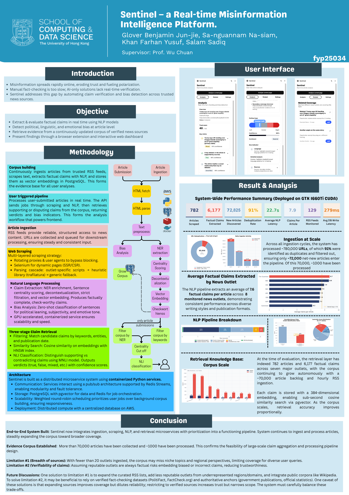

# Sentinel

Sentinel is a real-time misinformation intelligence platform designed to help readers inspect news content at the moment of consumption. The backend of the Sentinel app combines claim extraction, bias analysis, semantic retrieval, and asynchronous microservice orchestration to turn raw articles into structured, evidence-backed outputs.

This repository showcases the backend system behind that workflow: a production-oriented pipeline built with FastAPI, Redis Streams, PostgreSQL, pgvector, Docker, and transformer-based NLP components.

## What Sentinel Does

Sentinel supports two complementary product experiences:

- a browser extension for in-context article analysis
- a web dashboard for broader exploration of stored article intelligence

On the backend, the platform performs four core tasks:

- scrape and normalize article content from submitted URLs and monitored feeds
- extract claim-like statements and enrich them with NLP-derived metadata
- classify article-level bias and sentiment signals
- retrieve semantically related evidence from a growing news corpus

## Table of Contents
- [Accompanying Publications](#accompanying-publications)
  - [Poster](#poster)
  - [Report](#report)
- [Running the Project](#running-the-project)
  - [Prerequisites](#prerequisites)
  - [First-Time Setup](#first-time-setup)
  - [Choosing a Config](#choosing-a-config)
  - [Service Profiles](#service-profiles)
  - [Deploying the Stack](#deploying-the-stack)
  - [Accessing the API](#accessing-the-api)
  - [Code Quality](#code-quality)
- [System Architecture Overview](#system-architecture-overview)
- [Pipeline Walkthrough](#pipeline-walkthrough)
- [Technical Highlights](#technical-highlights)
- [NLP Pipeline Deep Dive](#nlp-pipeline-deep-dive)
- [Retrieval and Evidence Matching](#retrieval-and-evidence-matching)
- [Key Results and Metrics](#key-results-and-metrics)
- [Deployment and Scalability Story](#deployment-and-scalability-story)
- [Frontend Integration Context](#frontend-integration-context)
- [Tech Stack](#tech-stack)
- [Service Documentation](#service-documentation)


## Accompanying Publications

### Poster


### Technical Report
Read technical report here (https://drive.google.com/file/d/1MIzG_EaeoAWVHwlK8q9nzc6p9G-q8lVC/view?usp=sharing)

## Running the Project

### Prerequisites

Before setting up the project, install the following on your host machine:

- [Docker Desktop](https://www.docker.com/products/docker-desktop/) or Docker Engine with Compose support
- [Visual Studio Code](https://code.visualstudio.com/)
- [VS Code Dev Containers extension](https://marketplace.visualstudio.com/items?itemName=ms-vscode-remote.remote-containers)
- Git

**Windows users:** install [WSL2 with Ubuntu](https://learn.microsoft.com/en-us/windows/wsl/install) and clone the repository inside the WSL filesystem, not the Windows drive. Docker Desktop must be configured to use the WSL2 backend.

### First-Time Setup

1. **Clone the repository**

   ```bash
   git clone <repository-url>
   cd sentinel-backend
   ```

2. **Open in VS Code and reopen in the Dev Container**

   ```
   Ctrl+Shift+P → Dev Containers: Rebuild and Reopen in Container
   ```

   The first build downloads images and dependencies and takes around 15–30 minutes. Subsequent launches are fast.

3. **Create your environment file**

   Copy the template for the config you want to use:

   ```bash
   cp configs/.env.template configs/base/.env
   ```

   Then edit `configs/base/.env` and fill in at minimum:

   | Variable | Description |
   |---|---|
   | `POSTGRES_HOST` | database host (`postgres` for local container) |
   | `POSTGRES_USER` | database username |
   | `POSTGRES_PASSWORD` | database password |
   | `REDIS_HOST` | Redis host (`redis` for local container) |
   | `REDIS_PORT` | Redis port |
   | `COMPOSE_PROFILES` | comma-separated list of services to start |

   See [configs/.env.template](./configs/.env.template) for the full reference including NLP model names, resource limits, and stream names.

### Choosing a Config

The deploy script expects a config directory name as its argument. Each directory under `configs/` contains a `.env` file and an optional `docker-compose.override.yml`.

### Service Profiles

The `COMPOSE_PROFILES` variable in your `.env` controls which services start. Add the profiles you need as a comma-separated list:

| Profile | Starts |
|---|---|
| `local` | Redis and PostgreSQL containers |
| `api` | API service |
| `ingestor` | Ingestor service |
| `scraper` | Web scraper service |
| `nlp-cpu` | NLP service (CPU mode) |
| `nlp-gpu` | NLP service (GPU mode) |
| `retrieval-cpu` | Retrieval layer (CPU mode) |
| `retrieval-gpu` | Retrieval layer (GPU mode) |

Example for a full local stack without GPU:

```
COMPOSE_PROFILES=local,api,ingestor,scraper,nlp-cpu,retrieval-cpu
```

### Deploying the Stack

```bash
# Deploy all services for the chosen config
./scripts/deploy.sh base

# Stop and remove containers
./scripts/clean.sh base

# Wipe PostgreSQL and Redis data volumes
./scripts/clear_data.sh

# Tail logs for a specific service
./scripts/logs.sh sentinel-nlp-CPU-service-container
```

### Accessing the API

Once the API service is running, it is available at `http://localhost:8001`.

Submit an article job:

```bash
curl -X POST http://localhost:8001/api/v1/jobs \
  -H "Content-Type: application/json" \
  -d '{
    "title": "Article Title",
    "content": "Article body text...",
    "news_outlet": "Example News",
    "article_url": "https://example.com/article",
    "type": "user"
  }'
```

Poll for the result using the `uid` from the submission response:

```bash
curl "http://localhost:8001/api/v1/jobs/{uid}/result?timeout=30"
```

### Code Quality

Before committing changes, run the formatting and static analysis pipeline:

```bash
./scripts/format_and_lint.sh
```

This runs `autoflake`, `isort`, `black`, `flake8`, and `mypy` in sequence.

## System Architecture Overview

The backend is structured as a microservice system with two coordinated pipelines:

- a background pipeline that continuously ingests and processes articles into the knowledge base
- an on-demand pipeline that analyzes user-submitted articles in real time

The core services are:

- `api-service` for job submission and result delivery
- `ingestor-service` for RSS-based discovery of new articles
- `web_scraper-service` for URL resolution and content extraction
- `nlp-service` for analytical processing over article text
- `retrieval-layer` for evidence search, persistence, and verdict-oriented matching

Supporting infrastructure includes:

- Redis Streams for inter-service communication
- PostgreSQL for durable structured storage
- pgvector for embedding-backed similarity search
- Docker Compose for deployment and orchestration

## Pipeline Walkthrough

The backend flow is split by job type, but both paths share the same major processing stages.

### On-demand flow

```text
Client
  -> POST /api/v1/jobs
  -> user:to.be.scraped
  -> Web Scraper
  -> user:to.be.nlp
  -> NLP Service
  -> user:to.be.retrieval
  -> Retrieval Layer
  -> GET /api/v1/jobs/{uid}/result
```

### Background flow

```text
RSS feeds
  -> Ingestor
  -> background:to.be.scraped
  -> Web Scraper
  -> background:to.be.nlp
  -> NLP Service
  -> background:to.be.retrieval
  -> Retrieval Layer
  -> persistent corpus storage
```

The stream naming pattern follows `{job_type}:to.be.{stage}`, which keeps the pipeline explicit and easy to trace. Failed jobs are routed to stage-specific failure streams rather than being dropped, which preserves operational visibility and replayability.

## Technical Highlights

The backend is designed around several strong engineering ideas that make it a substantive systems project rather than a simple API wrapper.

- Two-lane priority architecture separates user work from background ingestion so interactive requests are not starved by corpus maintenance.
- Redis Streams provide persistent, decoupled stage handoff with consumer-group semantics and replayable failure handling.
- The NLP service uses transformer-based components for claim extraction, bias analysis, sentiment analysis, and semantic embedding.
- The retrieval stack combines relational filtering, vector similarity, and NLI-based reranking instead of relying on a single retrieval method.
- The system is built to run in distributed multi-instance deployments, with shared coordination over Redis and PostgreSQL.

## NLP Pipeline Deep Dive

The NLP service is the analytical core of Sentinel. It converts scraped article text into structured claims and article-level metadata that can be stored, searched, and surfaced to users.

Its major stages include:

- text preprocessing to clean and segment article content
- named entity recognition to identify people, organizations, locations, and related entities
- sentence extraction to reduce the article into high-value candidate statements
- decontextualization to rewrite context-dependent sentences into standalone claims
- check-worthiness filtering to keep only the most verification-relevant statements
- dense embedding generation for semantic retrieval
- bias and sentiment classification at the article level
- claim conversion and topic classification for downstream retrieval and presentation
- supports GPU acceleration and model preloading to keep transformer-heavy stages viable in production-style operation.

## Retrieval and Evidence Matching

The retrieval layer is responsible for turning extracted claims into evidence-backed outputs.

Instead of doing a single naive similarity search, the backend applies a retrieval cascade:

1. entity-based filtering narrows the candidate pool using claim-linked named entities
2. keyword filtering expands coverage through article-title matching
3. vector similarity search over pgvector embeddings surfaces semantically related claims
4. NLI-based classification determines whether candidate evidence supports, contradicts, or remains neutral toward the input claim

This layered approach reduces unnecessary compute early while preserving semantic depth later in the ranking process.

## Key Results and Metrics

Sentinel is beyond a conceptual prototype and operates as a deployed and evaluated platform.

To date, the system produces the following results across its deployment snapshots and evaluation runs:

- 7,954 total unique articles saved in the broader corpus snapshot
- 50,578 verifiable claims extracted across the broader deployment snapshot
- 27,354 unique named entities identified in the broader corpus snapshot
- 4,353 articles processed during the 96-hour evaluation window
- 24,252 verifiable claims extracted during that evaluation window
- 138,193 entity mentions identified during the same evaluation period
- an average of 5.6 verifiable claims extracted per article
- 99 completed user analysis jobs
- long-run ingestion deduplication efficiency above 98%

To date, the architecture demonstrates horizontal scaling across three deployment instances while preserving a shared corpus and coordinated pipeline state.

## Deployment and Scalability Story

Sentinel runs in a hybrid cloud-edge deployment model.

- Redis and PostgreSQL act as centralized coordination and persistence layers
- scraping and NLP-heavy workloads run on decentralized worker nodes
- multiple worker instances consume from shared streams using consumer-group patterns

This setup lets the system combine centralized state with distributed compute, which is a credible and technically interesting deployment strategy for transformer-heavy workloads.

## Frontend Integration Context

The backend system serves two client experiences.

- The browser extension submits article jobs and polls for completed analysis.
- The dashboard supports browsing and comparing previously processed content at larger scale.

The backend therefore is not just a data-processing pipeline; it is the service layer of a full product experience.

## Tech Stack

- Python
- FastAPI
- Redis
- PostgreSQL
- pgvector
- Docker & Docker Compose
- Selenium-based scraping & Trafilatura-based parsing
- transformer-based NLP models
- React and TypeScript clients consuming backend APIs

## Service Documentation

- [API service](./microservices/api/README.md)
- [Ingestor service](./microservices/ingestor/README.md)
- [Web scraper service](./microservices/web_scraper/README.md)
- [NLP service](./microservices/nlp/README.md)
- [Retrieval layer service](./microservices/retrieval_layer/README.md)

Database setup and schema assets live under `microservices/db/`, with migration-specific notes already documented in `microservices/db/migrations/README.md`.

## Setup and Usage

Full setup instructions, config options, service profiles, and deployment commands are covered in the [Running the Project](#running-the-project) section above.

The complete environment variable reference is in [configs/.env.template](./configs/.env.template).


