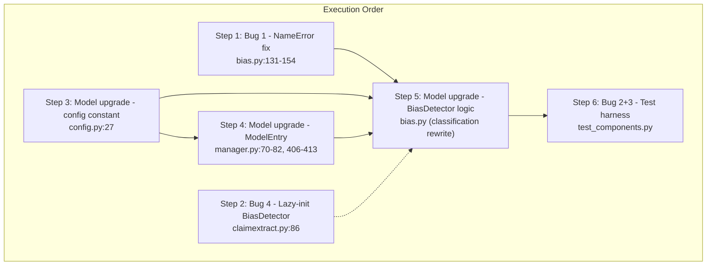

# Plan 1: BiasDetector Bug Fixes + Model Upgrade

**Scope constraint**: Only files inside `microservices/nlp/` and `common/model_manager/` may change. No schema changes, no retrieval layer changes, no API changes, no DB changes.

**Files in scope** (5 files):

| File | Action |
|---|---|
| `microservices/nlp/components/bias.py` | Modify |
| `microservices/nlp/components/claimextract.py` | Modify |
| `microservices/nlp/config.py` | Modify |
| `common/model_manager/manager.py` | Modify |
| `microservices/nlp/tests/debug_articles/test_components.py` | Modify |

---

## Dependency Graph



Steps 1 and 2 are independent of each other. Steps 3 and 4 are independent of each other but both block Step 5. Step 6 depends on all prior steps.

---

## Step 1: Fix NameError in `bias.py` except block (Bug 1 -- CRITICAL)

**Risk**: HIGH -- This is a runtime crash. Any political classification failure causes `NameError` instead of graceful degradation.

**File**: `microservices/nlp/components/bias.py`

**Problem**: At line 153, `result` is referenced in the `except` block, but `result = message.create_nlp_result()` does not happen until line 177. If the political classifier raises, `result` is undefined.

**Changes**:

1. **Move `result` creation before the try block** (insert at line 131, before `analysis_text`):
   ```python
   result = message.create_nlp_result()
   analysis_text = text[:BIAS_MAX_CHARS]
   ```

2. **Fix the except block at lines 151-154** -- add `message.set_nlp_result(result)` before `return`:
   ```python
   except Exception as e:
       logger.error(f"BiasDetector: Political bias classification failed: {e}")
       result.bias_profile = self._neutral_profile()
       message.set_nlp_result(result)
       return
   ```

3. **Remove the duplicate `result = message.create_nlp_result()` at line 177** (now redundant since `result` was created earlier).

**Pre-check**: None required.

**Verification**:
- Confirm `result` is defined before line 134 (the `try` block).
- Confirm the `except` block at line 151 ends with `message.set_nlp_result(result)` then `return`.
- Confirm there is no second `result = message.create_nlp_result()` later in the method.
- The happy path still assigns to `result.bias_profile` and calls `message.set_nlp_result(result)` at the end.

**Rollback**: Revert `bias.py` to its prior state. This step is purely local to one method.

---

## Step 2: Lazy-init BiasDetector in ClaimExtraction (Bug 4)

**Risk**: MEDIUM -- Reduces memory usage when bias is disabled. No behavioral change when bias IS enabled.

**File**: `microservices/nlp/components/claimextract.py`

**Problem**: Line 86 unconditionally instantiates `BiasDetector(...)`, loading ~760MB of models even when `options.enable_bias_detection` is `False`.

**Changes**:

1. **In `__init__` (line 86)**: Replace the eager instantiation with stored args:
   ```python
   # Replace:
   #   self.bias_detector = BiasDetector(device_config=device_config, model_manager=model_manager)
   # With:
   self._bias_device_config = device_config
   self._bias_model_manager = model_manager
   self._bias_detector = None
   ```

2. **In `run()` at the Stage 8 block (lines 282-297)**: Add lazy init before calling `run()`:
   ```python
   if options.enable_bias_detection:
       if self._bias_detector is None:
           self._bias_detector = BiasDetector(
               device_config=self._bias_device_config,
               model_manager=self._bias_model_manager,
           )
       t = time.time()
       try:
           message.add_timestamp(JobStage.BIAS_ANAL_IN)
           self._bias_detector.run(article, message, options)
           ...
   ```

3. **Update the reference** from `self.bias_detector` to `self._bias_detector` in the Stage 8 block.

**Pre-check**: Confirm that `BiasDetector.__init__` only needs `device_config` and `model_manager` (verified: line 63).

**Verification**:
- `__init__` no longer imports/loads bias models.
- When `enable_bias_detection=False`, `BiasDetector` is never instantiated.
- When `enable_bias_detection=True`, first call creates the instance; subsequent calls reuse it.
- No reference to `self.bias_detector` (without underscore prefix) remains.

**Rollback**: Revert `claimextract.py`. Bias detection will work but always load eagerly.

---

## Step 3: Update political bias model constant (Model Upgrade)

**Risk**: LOW -- Single string constant change.

**File**: `microservices/nlp/config.py`, line 27

**Change**:
```python
# From:
BIAS_POLITICAL_MODEL = "typeform/distilbert-base-uncased-mnli"
# To:
BIAS_POLITICAL_MODEL = "premsa/political-bias-prediction-allsides-BERT"
```

**Pre-check**: None. The model name is consumed by `manager.py` and `bias.py`; both will be updated in subsequent steps.

**Verification**:
- `config.py` line 27 reads `"premsa/political-bias-prediction-allsides-BERT"`.
- The env var override at line 110 (`NLP_BIAS_MODEL`) still works (it overrides the constant).

**Rollback**: Change the string back. All downstream code that reads `BIAS_POLITICAL_MODEL` reverts to old model.

---

## Step 4: Update ModelManager registration + remove special-case logic (Model Upgrade)

**Risk**: MEDIUM -- Changes model loading behavior. Must be coordinated with Step 5.

**File**: `common/model_manager/manager.py`

### Change 4a: Update `BIAS_POLITICAL` ModelEntry (lines 70-82)

```python
# From:
ModelEntry(
    key="BIAS_POLITICAL",
    model_name=os.environ.get(
        "NLP_BIAS_MODEL",
        "typeform/distilbert-base-uncased-mnli",
    ),
    task_type="zero_shot_classification",
    owner_component="BiasDetector",
    loader="transformers_pipeline",
    device_policy=DevicePolicy.PREFER_GPU,
    required=False,
    estimated_memory_mb=260,
),

# To:
ModelEntry(
    key="BIAS_POLITICAL",
    model_name=os.environ.get(
        "NLP_BIAS_MODEL",
        "premsa/political-bias-prediction-allsides-BERT",
    ),
    task_type="text_classification",
    owner_component="BiasDetector",
    loader="transformers_pipeline",
    device_policy=DevicePolicy.PREFER_GPU,
    required=False,
    estimated_memory_mb=440,
    loader_kwargs={"top_k": None},
),
```

Key differences:
- `model_name` default: `typeform/...` -> `premsa/...`
- `task_type`: `"zero_shot_classification"` -> `"text_classification"`
- `estimated_memory_mb`: `260` -> `440`
- `loader_kwargs`: added `{"top_k": None}` (returns all class scores, not just top-1)

### Change 4b: Remove the special-case `_resolve_hf_task` block (lines 406-413)

```python
# Remove this entire block:
if entry.key in ("BIAS", "BIAS_POLITICAL"):
    if "mnli" in entry.model_name.lower():
        return "zero-shot-classification"
    else:
        entry.loader_kwargs["return_all_scores"] = True
        return "text-classification"
```

This block is no longer needed because:
- `task_type="text_classification"` is now set directly on the ModelEntry.
- The `_TASK_MAP` at line 415 already maps `"text_classification"` -> `"text-classification"`.
- `top_k=None` in `loader_kwargs` replaces the deprecated `return_all_scores=True`.
- The `"BIAS"` key does not exist in the registry (only `"BIAS_POLITICAL"` and `"BIAS_SENTIMENT"` do), so the old `"BIAS"` match was dead code.

**Pre-check**: Verify the `_TASK_MAP` contains `"text_classification": "text-classification"` (confirmed at line 418).

**Verification**:
- `register_defaults()` registers `BIAS_POLITICAL` with `task_type="text_classification"` and `loader_kwargs={"top_k": None}`.
- `_resolve_hf_task()` no longer has any special case for `"BIAS"` or `"BIAS_POLITICAL"`.
- Loading `BIAS_POLITICAL` produces a `text-classification` pipeline.

**Rollback**: Revert `manager.py`. The old model + zero-shot task will be registered again.

---

## Step 5: Rewrite BiasDetector classification logic (Model Upgrade)

**Risk**: HIGH -- Core logic change. Requires the new model to be available.

**File**: `microservices/nlp/components/bias.py`

### REQUIRED PRE-CHECK (blocking)

Before writing any code for this step, the executor MUST run:

```bash
python -c "from transformers import AutoConfig; cfg = AutoConfig.from_pretrained('premsa/political-bias-prediction-allsides-BERT'); print(cfg.id2label)"
```

This will print the model's actual label mapping (e.g., `{0: 'Left', 1: 'Center', 2: 'Right'}`). The `_LABEL_MAP` below MUST match this output. Do NOT hardcode labels without running this command.

### Changes

**5a. Remove `POLITICAL_LABELS` class constant** (line 50):
```python
# DELETE:
POLITICAL_LABELS = ["left-leaning", "centrist", "right-leaning"]
```
This was the zero-shot hypothesis labels list. The new model is a direct classifier; it does not use candidate labels.

**5b. Update `_LABEL_MAP`** (lines 52-56):

Set based on the pre-check output. Expected mapping (verify!):
```python
_LABEL_MAP = {
    "Left":   "Left",
    "Center": "Center",
    "Right":  "Right",
}
```
If the model outputs lowercase or different strings (e.g., `"left"`, `"center"`, `"right"`), adjust accordingly. The values must match `BiasProfile.bias_category` conventions (`"Left"`, `"Center"`, `"Right"`).

**5c. Update `__init__` fallback pipeline** (lines 88-93):

```python
# From:
self.political_classifier = pipeline(
    "zero-shot-classification",
    model=BIAS_POLITICAL_MODEL,
    device=device_config.device_id,
    dtype=device_config.dtype,
)

# To:
self.political_classifier = pipeline(
    "text-classification",
    model=BIAS_POLITICAL_MODEL,
    device=device_config.device_id,
    dtype=device_config.dtype,
    top_k=None,
)
```

**5d. Update the political classification call in `run()`** (lines 134-149):

```python
# From (zero-shot with hypothesis template):
bias_out = self.political_classifier(
    analysis_text,
    self.POLITICAL_LABELS,
    multi_label=False,
    hypothesis_template="This text has a {} political perspective.",
)
raw_label  = bias_out["labels"][0]
confidence = float(bias_out["scores"][0])
scores: Dict[str, float] = {
    self._LABEL_MAP[lbl]: float(sc)
    for lbl, sc in zip(bias_out["labels"], bias_out["scores"])
}
political_bias = self._LABEL_MAP.get(raw_label, "Center")

# To (direct text-classification):
bias_out = self.political_classifier(analysis_text)
# bias_out is a list of dicts: [{"label": "Left", "score": 0.85}, ...]
# Sorted by score descending when top_k=None.
top = bias_out[0]
raw_label  = top["label"]
confidence = float(top["score"])
scores: Dict[str, float] = {
    self._LABEL_MAP.get(item["label"], item["label"]): float(item["score"])
    for item in bias_out
}
political_bias = self._LABEL_MAP.get(raw_label, "Center")
```

Key differences:
- No `candidate_labels` argument, no `hypothesis_template`, no `multi_label`.
- Output format changes: zero-shot returns `{"labels": [...], "scores": [...]}`, text-classification returns `[{"label": ..., "score": ...}, ...]`.

**5e. Update docstring** (lines 19-48):

Replace the description of "Zero-Shot NLI" strategy with:
```
1.  Political Bias via Direct Classification (premsa/political-bias-prediction-allsides-BERT):
    The article text (truncated to POLITICAL_MAX_CHARS characters) is classified
    into one of three categories: Left, Center, Right.
    The model is fine-tuned on AllSides-rated news articles and outputs
    calibrated probabilities for each class (F1=0.904).
```

**Verification**:
- `POLITICAL_LABELS` class attribute no longer exists.
- The `run()` method does NOT pass `candidate_labels` or `hypothesis_template` to the classifier.
- The classifier is called with a single string argument: `self.political_classifier(analysis_text)`.
- `_LABEL_MAP` keys match the model's actual `id2label` values (from pre-check).
- The fallback `pipeline(...)` in `__init__` uses `"text-classification"` task, not `"zero-shot-classification"`.
- Step 1 fix (NameError) is still intact after this rewrite.

**Rollback**: Revert `bias.py` and also revert Steps 3 and 4 (config + manager). All three must be reverted together.

---

## Step 6: Fix test harness (Bug 2 + Bug 3)

**Risk**: MEDIUM -- Test-only changes. No production impact.

**File**: `microservices/nlp/tests/debug_articles/test_components.py`

### Change 6a: Fix model keys (Bug 2, lines 146-153)

```python
# From:
COMPONENT_MODEL_KEYS = {
    "preprocessor": ["SPACY_SENT"],
    "embedder": ["SPACY_SENT", "EMBEDDING"],
    "ner": ["SPACY_SENT", "EMBEDDING", "NER"],
    "bias": ["SPACY_SENT", "EMBEDDING", "BIAS"],
    "checkworthy": ["SPACY_SENT", "EMBEDDING", "NER", "CHECKWORTHY"],
    "all": ["SPACY_SENT", "EMBEDDING", "NER", "BIAS", "CHECKWORTHY"],
}

# To:
COMPONENT_MODEL_KEYS = {
    "preprocessor": ["SPACY_SENT"],
    "embedder": ["SPACY_SENT", "EMBEDDING"],
    "ner": ["SPACY_SENT", "EMBEDDING", "NER"],
    "bias": ["SPACY_SENT", "EMBEDDING", "BIAS_POLITICAL", "BIAS_SENTIMENT"],
    "checkworthy": ["SPACY_SENT", "EMBEDDING", "NER", "CHECKWORTHY"],
    "all": ["SPACY_SENT", "EMBEDDING", "NER", "BIAS_POLITICAL", "BIAS_SENTIMENT", "CHECKWORTHY"],
}
```

The `"BIAS"` key does not exist in ModelManager. The correct keys are `"BIAS_POLITICAL"` and `"BIAS_SENTIMENT"`.

### Change 6b: Update env var for new model (line 74)

```python
# From:
os.environ["NLP_BIAS_MODEL"] = "typeform/distilbert-base-uncased-mnli"
# To:
os.environ["NLP_BIAS_MODEL"] = "premsa/political-bias-prediction-allsides-BERT"
```

### Change 6c: Fix `run_component()` interface mismatch (Bug 3, lines 302-322)

The current `run_component()` has two problems:
1. `cls()` is called with no args. `BiasDetector`, `EntityRecognizer`, and `Embedder` all require `device_config` as a positional-ish argument.
2. Components expect `StreamMessage` as their second argument, but the test passes `NLPResult`.

**Replacement for `run_component()`**:

```python
from microservices.nlp.components.device import DeviceConfig
from common.models.api.redis_models import (
    Article, Message, MessageHeader, MessagePayload,
    NLPOptions, NLPResult, SentenceScore, StreamMessage,
)
import uuid

# Device config for test (CPU-only)
DEVICE_CONFIG = DeviceConfig.resolve(use_gpu=False)


def _make_test_stream_message(article: Article) -> StreamMessage:
    """Create a minimal StreamMessage wrapping the given article for testing."""
    header = MessageHeader(
        uid=str(uuid.uuid4()),
        type="user",
        status="processing",
        created_at="2026-01-01T00:00:00Z",
    )
    payload = MessagePayload(
        article_url=article.link,
        parsed_text=article.text,
        title=article.title,
        summary=article.summary,
        news_outlet=article.source,
    )
    message = Message(header=header, payload=payload, stage_timestamps=[])
    return StreamMessage(stream="test", redis_id="0-0", priority=1, data=message)


def run_component(
    name: str,
    article: Article,
    result: NLPResult,
    options: NLPOptions,
    sentences: list,
):
    """Instantiate and run a single component. Returns (elapsed, sentences)."""
    cls = COMPONENT_CLASSES[name]
    ctype = COMPONENT_TYPES[name]

    # Instantiate with correct constructor args per component
    if name == "preprocessor":
        import spacy
        nlp_sm = spacy.load("en_core_web_sm", disable=["lemmatizer"])
        component = cls(nlp=nlp_sm)
    elif name in ("bias", "ner", "embedder"):
        component = cls(device_config=DEVICE_CONFIG, model_manager=model_manager)
    elif name == "checkworthy":
        component = cls(device_config=DEVICE_CONFIG)
    else:
        component = cls()

    # Build a StreamMessage for components that need it
    message = _make_test_stream_message(article)

    # Copy current NLPResult state into the StreamMessage
    # so components can read prior stage outputs
    if result.entities_in_article:
        message.data.payload.entities_in_article = result.entities_in_article
    if result.claims_in_article:
        message.data.payload.claims_in_article = result.claims_in_article
    if result.bias_profile:
        message.data.payload.bias_profile = result.bias_profile

    t0 = time.monotonic()
    if ctype == "SentenceGenerator":
        # Preprocessor: run(article, message, options) -> List[SentenceScore]
        sentences = component.run(article, message, options)
    elif ctype == "SentenceProcessor":
        # Embedder, CheckWorthiness: run(article, message, options, sentences) -> List[SentenceScore]
        sentences = component.run(article, message, options, sentences)
    elif ctype == "SentenceConsumer":
        # NER: run(article, message, options, sentences) -> None
        component.run(article, message, options, sentences)
    else:
        # ArticleProcessor (BiasDetector): run(article, message, options) -> None
        component.run(article, message, options)

    # Copy results back from StreamMessage to local NLPResult
    msg_result = message.create_nlp_result()
    if msg_result.entities_in_article:
        result.entities_in_article = msg_result.entities_in_article
    if msg_result.claims_in_article:
        result.claims_in_article = msg_result.claims_in_article
    if msg_result.bias_profile:
        result.bias_profile = msg_result.bias_profile

    return time.monotonic() - t0, sentences
```

**Important**: Add `import uuid` to the imports at the top of the file. Add `MessageHeader`, `MessagePayload`, `Message`, `StreamMessage` to the existing import from `common.models.api.redis_models` (line 104).

**Pre-check**: Verify that `Preprocessor.run()` signature is `(article, message, options)` not `(article, result, options)`. Confirmed: line 205 of `preprocess.py` shows `def run(self, article: Article, message: StreamMessage, options: NLPOptions)`.

**Verification**:
- Running `python test_components.py bbc_001.json --component bias` no longer crashes with `TypeError` on instantiation.
- Running `python test_components.py bbc_001.json --component all` processes all stages without `TypeError`.
- The bias output shows `bias_category` as one of `Left`, `Center`, `Right` (not the old `left-leaning` etc.).

**Rollback**: Revert `test_components.py`. Test harness returns to broken state but production is unaffected.

---

## Risk Assessment Table

| Step | Risk | Severity | Likelihood of Regression | Rollback Complexity |
|------|------|----------|--------------------------|---------------------|
| 1: NameError fix | HIGH | Critical (runtime crash) | Unlikely (straightforward move) | Trivial (single file) |
| 2: Lazy-init BiasDetector | MEDIUM | Low (memory optimization) | Unlikely (well-defined pattern) | Trivial (single file) |
| 3: Config constant | LOW | Low (string change) | None | Trivial |
| 4: ModelEntry + _resolve_hf_task | MEDIUM | High (affects model loading) | Possible (if model unavailable) | Easy (single file) |
| 5: BiasDetector rewrite | HIGH | High (core classification logic) | Probable during dev (new output format) | Moderate (requires reverting Steps 3+4+5 together) |
| 6: Test harness fix | MEDIUM | None (test-only) | Possible (interface sync) | Trivial (single file) |

---

## Coupled Rollback Groups

Steps 3, 4, and 5 form a **coupled group**. If any one fails, all three must be reverted together:
- Step 3 changes the model name constant.
- Step 4 changes the ModelEntry task type to match the new model.
- Step 5 changes the classification code to consume the new model's output format.

These three are incompatible with the old model and vice versa.

Steps 1 and 2 are **independent** and can be kept or reverted individually.

Step 6 depends on Steps 3-5 only for the env var and model keys. If Steps 3-5 are reverted, the env var at 6b must also revert to the old model name. Changes 6a and 6c (model keys fix and interface fix) should be kept regardless.

---

## Test Strategy

### After Step 1 (NameError fix)
```bash
# Simulated: no automated test exists for the error path yet.
# Manual verification: read the code and confirm `result` is defined before use.
```

### After Step 2 (Lazy-init)
```bash
# No test needed. Verified structurally.
```

### After Steps 3+4+5 (Model upgrade -- all must be complete)
```bash
# Pre-check (BLOCKING):
python -c "from transformers import AutoConfig; cfg = AutoConfig.from_pretrained('premsa/political-bias-prediction-allsides-BERT'); print(cfg.id2label)"

# Smoke test (requires model downloaded):
python -c "
from transformers import pipeline
p = pipeline('text-classification', model='premsa/political-bias-prediction-allsides-BERT', top_k=None)
out = p('The president signed the new healthcare reform bill today.')
print(out)
"
```

### After Step 6 (Test harness)
```bash
cd /workspaces/sentinel-backend
python microservices/nlp/tests/debug_articles/test_components.py microservices/nlp/tests/debug_articles/bbc_001.json --component bias
python microservices/nlp/tests/debug_articles/test_components.py microservices/nlp/tests/debug_articles/bbc_001.json --component all
```

### Full regression
```bash
pytest tests/ -x -q
```

---

## Deployment Notes

No Docker image changes required. The new model (`premsa/political-bias-prediction-allsides-BERT`) will be auto-downloaded on first load if not cached. Estimated download size: ~440MB.

If deploying to a production environment with no internet access, pre-download the model into the HF cache before deploying:
```bash
python -c "from transformers import AutoModelForSequenceClassification, AutoTokenizer; AutoModelForSequenceClassification.from_pretrained('premsa/political-bias-prediction-allsides-BERT'); AutoTokenizer.from_pretrained('premsa/political-bias-prediction-allsides-BERT')"
```

No stream topology changes. No database migrations. No API contract changes. The `BiasProfile` output schema is unchanged; only the values in `bias_category` change from `{"Left", "Center", "Right"}` (same canonical values, but now produced by a fine-tuned classifier instead of zero-shot NLI).
