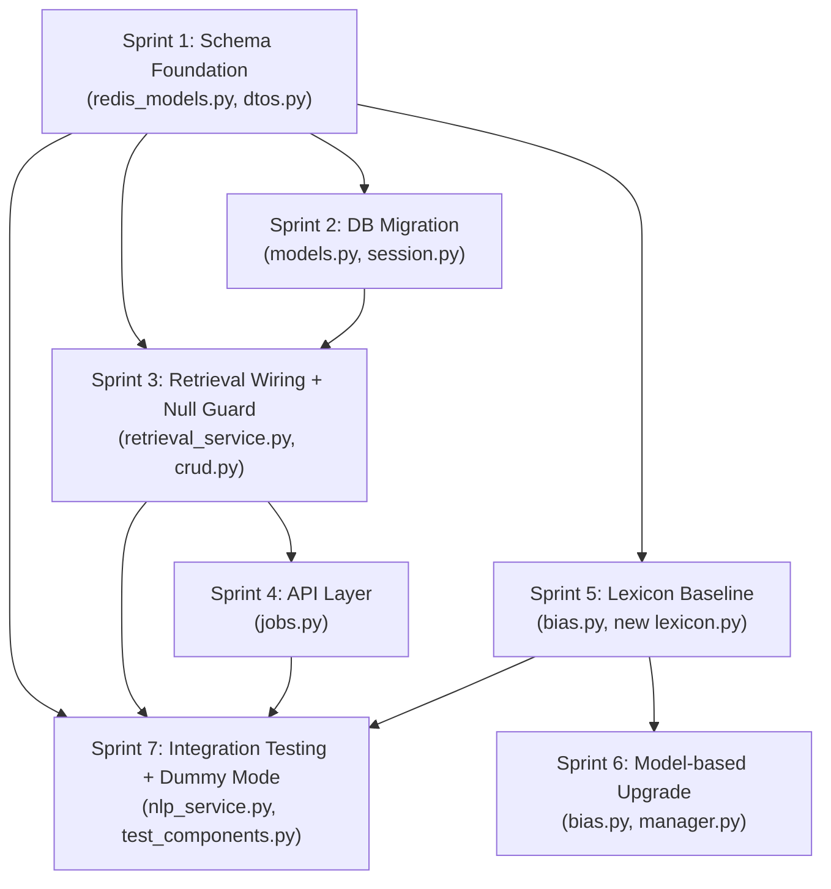

# Plan 2: Linguistic/Framing Bias Detection with Frontend Text Highlighting

**Status:** Ready for execution
**Created:** 2026-04-12
**Agent:** systems-planner

---

## Table of Contents

1. [Sprint Dependency Graph](#sprint-dependency-graph)
2. [Risk Table](#risk-table)
3. [Known Breaking Changes](#known-breaking-changes)
4. [Sprint 1 -- Schema Foundation](#sprint-1--schema-foundation)
5. [Sprint 2 -- DB Migration](#sprint-2--db-migration)
6. [Sprint 3 -- Retrieval Layer Wiring + Null Guard](#sprint-3--retrieval-layer-wiring--null-guard)
7. [Sprint 4 -- API Layer](#sprint-4--api-layer)
8. [Sprint 5 -- Lexicon Baseline (NLP)](#sprint-5--lexicon-baseline-nlp)
9. [Sprint 6 -- Model-based Upgrade (NLP)](#sprint-6--model-based-upgrade-nlp)
10. [Sprint 7 -- Integration Testing + Dummy Mode](#sprint-7--integration-testing--dummy-mode)

---

## Sprint Dependency Graph



**Critical path:** S1 -> S2 -> S3 -> S4 -> S7

**Parallel tracks possible:**
- S5 (Lexicon Baseline) can begin immediately after S1, in parallel with S2/S3/S4
- S6 (Model-based) depends only on S5

---

## Risk Table

| Risk ID | Component | Severity | Likelihood | Description | Mitigation |
|---------|-----------|----------|------------|-------------|------------|
| R1 | `redis_models.py` BiasProfile | **High** | Certain | Adding `linguistic_flags` field changes a dataclass used by NLP, Retrieval, and API. If default is missing, existing messages without the field will fail deserialization. | Use `field(default_factory=list)` -- backward compatible. Existing `BiasProfile` objects created without the field get `[]`. |
| R2 | `retrieval_service.py:134` | **Critical** | Certain | Known null-crash: `bias_profile.bias_category` crashes when `bias_profile is None`. This is a pre-existing bug that must be fixed in Sprint 3. | Add explicit None-guard before accessing attributes. |
| R3 | `SentimentAnalysis` DB model | **Medium** | Certain | Adding a JSON column to an existing table. If `create_all()` is used on an existing DB, column won't be auto-added -- SQLAlchemy `create_all()` only creates new tables. | Use `ensure_schema_compatibility()` pattern already established in `session.py` to ADD COLUMN IF NOT EXISTS. |
| R4 | `asdict()` serialization | **Low** | Unlikely | `dataclasses.asdict()` recursively converts nested dataclasses. `List[LinguisticFlag]` becomes `List[dict]` automatically. Already verified this is how `BiasProfile` is serialized at line 279 of `redis_models.py`. | No action needed -- works out of the box. |
| R5 | Redis hash payload size | **Medium** | Possible | Articles with many linguistic flags (e.g., 50+ flags at ~200 bytes each = ~10KB extra) increase Redis hash payload size. | Cap flags at 50 per article in the detector. Log a warning if capped. |
| R6 | `set_nlp_result()` guard | **Medium** | Probable | Line 321: `if not self.data.payload.bias_profile` -- this guard means if a previous pipeline stage already set `bias_profile`, the linguistic flags won't be added. BiasDetector is Stage 8 (last) so it writes `bias_profile` from scratch. | Verify that no earlier stage writes to `bias_profile`. Currently only BiasDetector (Stage 8) does. Safe as-is. |
| R7 | Lexicon false positives | **Medium** | Probable | Lexicon-based detection will flag common phrases out of context (e.g., "clearly" flagged as loaded language in "clearly visible"). | Include minimum-context window checks (word must not be in safe-context phrases). Accept some false positives for v1. |
| R8 | `test_components.py` dispatch | **Low** | Certain | Test harness uses old-style dispatch `component.run(article, result, options)` at line 321, but BiasDetector now takes `(article, message, options)`. Test harness passes `result` not `message`. | Must be addressed in Sprint 7 -- test harness already uses incorrect dispatch type for bias. |
| R9 | Model memory (Sprint 6) | **High** | Possible | Adding a token-classification model adds ~300-600MB to GPU memory. Current NLP image is already heavy. | Sprint 6 is optional. CPU-viable models only. Can skip if memory budget is tight. |
| R10 | `MessagePayload` Pydantic model | **Low** | Unlikely | `BiasProfile` is referenced as `Optional[BiasProfile] = None` in `MessagePayload` (line 192). Adding `linguistic_flags` to `BiasProfile` is transparent to Pydantic since BiasProfile is a dataclass, not a Pydantic model. | No action needed. |

---

## Known Breaking Changes

### No breaking changes expected

This plan is fully backward-compatible at every sprint boundary:

1. **`LinguisticFlag` list defaults to `[]`** -- existing `BiasProfile` instances created without the field are valid.
2. **DB column `linguistic_flags` is nullable JSON** -- existing rows have `NULL`, which is read as `None`/`[]`.
3. **API response adds `linguisticFlags` key** -- this is additive; frontend ignores unknown keys until it's ready to consume them.
4. **Redis hash payload** -- `asdict()` on the expanded `BiasProfile` adds a `linguistic_flags` key to the dict. Old consumers ignore unknown keys.

### Momentary incompatibility windows

| Window | Duration | Impact |
|--------|----------|--------|
| NLP service restarted before Retrieval | Until Retrieval restarts | Retrieval receives `linguistic_flags` in `bias_profile` dict but ignores it (writes to old schema). Data not stored but not lost -- still in Redis hash for API to read. |
| DB migration runs before Retrieval code update | Until Retrieval code deployed | New column exists but CRUD code doesn't write to it. Column stays NULL. Harmless. |
| API code deployed before NLP produces flags | Indefinitely (until Sprint 5) | API returns `"linguisticFlags": []`. Frontend sees empty array. |

**Recommended deployment order per sprint:** DB migration first, then Retrieval, then API, then NLP.

---

## Sprint 1 -- Schema Foundation

### Goal
Add the `LinguisticFlag` dataclass and extend `BiasProfile` with a `linguistic_flags` field in the shared data contracts. Update the retrieval DTO. No behavior change -- empty list default.

### Dependencies
None (first sprint).

### Files Changed

#### 1. `common/models/api/redis_models.py`

**Add `LinguisticFlag` dataclass** (insert after line 153, before `NLPResult`):

```python
# --- BEFORE (line 147-154) ---
@dataclass
class BiasProfile:
    """Result of political and emotional bias analysis."""
    bias_category:Optional[str] # e.g., "Left", "Center", "Right"
    bias_score:Optional[float]
    bias_analysis_confidence:Optional[float]
    sentiment_category:Optional[str]
    sentiment_analysis_confidence:Optional[float]

# --- AFTER ---
@dataclass
class LinguisticFlag:
    """A span of text flagged for linguistic bias."""
    text: str           # exact substring from article.text
    start_char: int     # character offset into article.text
    end_char: int       # character offset into article.text
    flag_type: str      # "loaded_language" | "emotional_appeal" | "hedging" | "framing"
    confidence: float   # 0.0-1.0


@dataclass
class BiasProfile:
    """Result of political and emotional bias analysis."""
    bias_category: Optional[str]  # e.g., "Left", "Center", "Right"
    bias_score: Optional[float]
    bias_analysis_confidence: Optional[float]
    sentiment_category: Optional[str]
    sentiment_analysis_confidence: Optional[float]
    linguistic_flags: List[LinguisticFlag] = field(default_factory=list)  # NEW
```

**Key detail:** `LinguisticFlag` must be defined BEFORE `BiasProfile` because `BiasProfile` references it in type annotations.

**Serialization verification:** At line 279, `StreamMessage.retrieval_results` uses `asdict(self.data.payload.bias_profile)`. The `dataclasses.asdict()` function recursively converts nested dataclasses, so `List[LinguisticFlag]` becomes `List[dict]` with keys `{"text", "start_char", "end_char", "flag_type", "confidence"}`. No custom serializer needed.

#### 2. `microservices/retrieval_layer/storage/dtos.py`

**Extend `CreateOrModifySentiment`** (lines 22-27):

```python
# --- BEFORE ---
@dataclass
class CreateOrModifySentiment:
    bias_category: Optional[str] = None
    bias_score: Optional[float] = None
    bias_analysis_confidence: Optional[float] = None
    sentiment_category: Optional[str] = None
    sentiment_analysis_confidence: Optional[float] = None

# --- AFTER ---
from typing import List, Optional, Any  # update existing import at line 2

@dataclass
class CreateOrModifySentiment:
    bias_category: Optional[str] = None
    bias_score: Optional[float] = None
    bias_analysis_confidence: Optional[float] = None
    sentiment_category: Optional[str] = None
    sentiment_analysis_confidence: Optional[float] = None
    linguistic_flags: Optional[List[Any]] = None  # NEW: List of LinguisticFlag dicts (already serialized)
```

**Note:** We use `List[Any]` not `List[LinguisticFlag]` because by the time data reaches the DTO, it has already been through `asdict()` and is a list of plain dicts. This avoids importing NLP-layer types into the retrieval layer.

#### 3. `microservices/nlp/components/bias.py`

**Update `_neutral_profile()`** (lines 107-115):

```python
# --- BEFORE ---
def _neutral_profile(self) -> BiasProfile:
    """Returns a zero-confidence neutral bias profile for graceful degradation."""
    return BiasProfile(
        bias_category="Center",
        bias_score=0.0,
        bias_analysis_confidence=0.0,
        sentiment_category="Neutral",
        sentiment_analysis_confidence=0.0,
    )

# --- AFTER ---
def _neutral_profile(self) -> BiasProfile:
    """Returns a zero-confidence neutral bias profile for graceful degradation."""
    return BiasProfile(
        bias_category="Center",
        bias_score=0.0,
        bias_analysis_confidence=0.0,
        sentiment_category="Neutral",
        sentiment_analysis_confidence=0.0,
        linguistic_flags=[],
    )
```

**Also update the main BiasProfile construction** at lines 178-184:

```python
# --- BEFORE ---
result.bias_profile = BiasProfile(
    bias_category=political_bias,
    bias_score=bias_score,
    bias_analysis_confidence=confidence,
    sentiment_category=emotional_tone,
    sentiment_analysis_confidence=sentiment_confidence,
)

# --- AFTER ---
result.bias_profile = BiasProfile(
    bias_category=political_bias,
    bias_score=bias_score,
    bias_analysis_confidence=confidence,
    sentiment_category=emotional_tone,
    sentiment_analysis_confidence=sentiment_confidence,
    linguistic_flags=[],  # populated by Sprint 5
)
```

**Update import** at line 9:

```python
# --- BEFORE ---
from common.models.api.redis_models import Article, BiasProfile, Message, NLPOptions, NLPResult, StreamMessage

# --- AFTER ---
from common.models.api.redis_models import Article, BiasProfile, LinguisticFlag, Message, NLPOptions, NLPResult, StreamMessage
```

### Interface Contract (Sprint 1 output)

After Sprint 1, all `BiasProfile` instances carry:
```python
BiasProfile(
    bias_category="Center",
    bias_score=0.0,
    bias_analysis_confidence=0.0,
    sentiment_category="Neutral",
    sentiment_analysis_confidence=0.0,
    linguistic_flags=[],  # always present, possibly empty
)
```

Serialized (via `asdict()`):
```json
{
    "bias_category": "Center",
    "bias_score": 0.0,
    "bias_analysis_confidence": 0.0,
    "sentiment_category": "Neutral",
    "sentiment_analysis_confidence": 0.0,
    "linguistic_flags": []
}
```

### Verification Steps

1. Run `python -c "from common.models.api.redis_models import BiasProfile, LinguisticFlag; bp = BiasProfile('Center', 0.0, 0.0, 'Neutral', 0.0); print(bp.linguistic_flags)"` -- should print `[]`.
2. Run `python -c "from dataclasses import asdict; from common.models.api.redis_models import BiasProfile, LinguisticFlag; bp = BiasProfile('Left', 0.8, 0.9, 'Negative', 0.7, [LinguisticFlag('devastating', 10, 21, 'loaded_language', 0.85)]); import json; print(json.dumps(asdict(bp), indent=2))"` -- should print full nested dict.
3. Run `./scripts/format_and_lint.sh` -- no lint errors.

### Rollback
Revert changes to `redis_models.py`, `dtos.py`, and `bias.py`. Remove `LinguisticFlag` class. Remove `linguistic_flags` field from `BiasProfile` and `CreateOrModifySentiment`. No DB changes to revert.

---

## Sprint 2 -- DB Migration

### Goal
Add a `linguistic_flags` JSON column to the `SentimentAnalysis` PostgreSQL table via the existing `ensure_schema_compatibility()` migration pattern.

### Dependencies
Sprint 1 (schema foundation must exist).

### Files Changed

#### 1. `microservices/retrieval_layer/db/models.py`

**Add JSON column to `SentimentAnalysis`** (after line 77):

```python
# --- BEFORE (lines 70-78) ---
class SentimentAnalysis(Base):
    __tablename__ = "sentiment_analysis"
    id = Column(Integer, primary_key=True, autoincrement=True)
    bias_category = Column(String(50), nullable=True)
    bias_score = Column(Float, nullable=True)
    bias_analysis_confidence = Column(Float, nullable=True)
    sentiment_category = Column(String(50), nullable=True)
    sentiment_analysis_confidence = Column(Float, nullable=True)
    article = relationship("Article", back_populates="sentiment")

# --- AFTER ---
class SentimentAnalysis(Base):
    __tablename__ = "sentiment_analysis"
    id = Column(Integer, primary_key=True, autoincrement=True)
    bias_category = Column(String(50), nullable=True)
    bias_score = Column(Float, nullable=True)
    bias_analysis_confidence = Column(Float, nullable=True)
    sentiment_category = Column(String(50), nullable=True)
    sentiment_analysis_confidence = Column(Float, nullable=True)
    linguistic_flags = Column(JSON, nullable=True)  # NEW: List[LinguisticFlag] as JSON
    article = relationship("Article", back_populates="sentiment")
```

**Note:** `JSON` is already imported at line 2 (`from sqlalchemy import ... JSON`). No new import needed.

#### 2. `microservices/retrieval_layer/db/session.py`

**Add migration statement to `ensure_schema_compatibility()`** (after the article column migration block, ~line 59):

```python
# --- INSERT after line 59 (after the article column migration loop) ---

        # Backfill sentiment_analysis table
        if "sentiment_analysis" in inspector.get_table_names():
            sa_columns = {col["name"] for col in inspector.get_columns("sentiment_analysis")}
            if "linguistic_flags" not in sa_columns:
                connection.execute(
                    text("ALTER TABLE sentiment_analysis ADD COLUMN IF NOT EXISTS linguistic_flags JSON")
                )
                logger.info("Retrieval DB migration: added sentiment_analysis.linguistic_flags")
```

This goes BEFORE the foreign key constraint block (before line 61).

### Schema Diff

```sql
-- BEFORE
CREATE TABLE sentiment_analysis (
    id SERIAL PRIMARY KEY,
    bias_category VARCHAR(50),
    bias_score FLOAT,
    bias_analysis_confidence FLOAT,
    sentiment_category VARCHAR(50),
    sentiment_analysis_confidence FLOAT
);

-- AFTER
CREATE TABLE sentiment_analysis (
    id SERIAL PRIMARY KEY,
    bias_category VARCHAR(50),
    bias_score FLOAT,
    bias_analysis_confidence FLOAT,
    sentiment_category VARCHAR(50),
    sentiment_analysis_confidence FLOAT,
    linguistic_flags JSON          -- NEW (nullable, default NULL)
);
```

### Verification Steps

1. Run `python -m microservices.retrieval_layer.db.create_tables` -- should print migration log if column doesn't exist, or run silently if it does.
2. Connect to PostgreSQL and run: `SELECT column_name, data_type FROM information_schema.columns WHERE table_name = 'sentiment_analysis';` -- should show `linguistic_flags | json`.
3. Verify idempotency: run `create_tables` again -- no error, no duplicate column.

### Rollback
```sql
ALTER TABLE sentiment_analysis DROP COLUMN IF EXISTS linguistic_flags;
```
Revert code changes to `models.py` and `session.py`.

---

## Sprint 3 -- Retrieval Layer Wiring + Null Guard

### Goal
Fix the confirmed null-crash bug in `retrieval_service.py`, pass `linguistic_flags` through the DTO to the DB write, and wire up the `extend_evidence_claims_into_articles` function to include linguistic flags in related article data.

### Dependencies
Sprint 1 (schema), Sprint 2 (DB column).

### Files Changed

#### 1. `microservices/retrieval_layer/services/retrieval_service.py`

**Fix null-crash and pass linguistic_flags** (lines 131-134):

```python
# --- BEFORE (lines 131-134) ---
        bias_profile = message.bias_profile
        
        article_dto = CreateOrModifyArticle(message.link, message.title, message.text, message.html, message.publish_date, message.data.payload.author)
        sentiment_dto = CreateOrModifySentiment(bias_profile.bias_category, bias_profile.bias_score, bias_profile.bias_analysis_confidence, bias_profile.sentiment_category, bias_profile.sentiment_analysis_confidence)

# --- AFTER ---
        bias_profile = message.bias_profile

        article_dto = CreateOrModifyArticle(message.link, message.title, message.text, message.html, message.publish_date, message.data.payload.author)

        if bias_profile is not None:
            from dataclasses import asdict
            # Serialize linguistic_flags to list-of-dicts for JSON storage
            raw_flags = getattr(bias_profile, 'linguistic_flags', None)
            serialized_flags = None
            if raw_flags:
                serialized_flags = [
                    asdict(f) if hasattr(f, '__dataclass_fields__') else f
                    for f in raw_flags
                ]
            sentiment_dto = CreateOrModifySentiment(
                bias_category=bias_profile.bias_category,
                bias_score=bias_profile.bias_score,
                bias_analysis_confidence=bias_profile.bias_analysis_confidence,
                sentiment_category=bias_profile.sentiment_category,
                sentiment_analysis_confidence=bias_profile.sentiment_analysis_confidence,
                linguistic_flags=serialized_flags,
            )
        else:
            self.logger.warning(
                "bias_profile is None for article url=%s — using empty sentiment",
                message.link,
            )
            sentiment_dto = CreateOrModifySentiment()
```

**Import note:** `from dataclasses import asdict` is placed inside the conditional block to keep it local. Alternatively, move to top-level imports.

#### 2. `microservices/retrieval_layer/storage/crud.py`

**Update `create_sentiment()`** (lines 52-63):

```python
# --- BEFORE ---
def create_sentiment(db: Session, sentiment_dto: CreateOrModifySentiment) -> SentimentAnalysis:
    new_sentiment_entry = SentimentAnalysis(
        bias_category=sentiment_dto.bias_category,
        bias_score=sentiment_dto.bias_score,
        bias_analysis_confidence=sentiment_dto.bias_analysis_confidence,
        sentiment_category=sentiment_dto.sentiment_category,
        sentiment_analysis_confidence=sentiment_dto.sentiment_analysis_confidence,
    )
    
    db.add(new_sentiment_entry)
    db.flush()
    return new_sentiment_entry

# --- AFTER ---
def create_sentiment(db: Session, sentiment_dto: CreateOrModifySentiment) -> SentimentAnalysis:
    new_sentiment_entry = SentimentAnalysis(
        bias_category=sentiment_dto.bias_category,
        bias_score=sentiment_dto.bias_score,
        bias_analysis_confidence=sentiment_dto.bias_analysis_confidence,
        sentiment_category=sentiment_dto.sentiment_category,
        sentiment_analysis_confidence=sentiment_dto.sentiment_analysis_confidence,
        linguistic_flags=sentiment_dto.linguistic_flags,  # NEW
    )

    db.add(new_sentiment_entry)
    db.flush()
    return new_sentiment_entry
```

### Interface Contract (Sprint 3 input/output)

**Input (from NLP via Redis Stream):**
```json
{
    "bias_profile": {
        "bias_category": "Left",
        "bias_score": 0.82,
        "bias_analysis_confidence": 0.91,
        "sentiment_category": "Negative",
        "sentiment_analysis_confidence": 0.77,
        "linguistic_flags": [
            {"text": "devastating", "start_char": 45, "end_char": 56, "flag_type": "loaded_language", "confidence": 0.88}
        ]
    }
}
```

**Output (to PostgreSQL `sentiment_analysis` table):**
```
| id | bias_category | bias_score | ... | linguistic_flags                                    |
|----|---------------|------------|-----|-----------------------------------------------------|
| 42 | Left          | 0.82       | ... | [{"text":"devastating","start_char":45,...}]         |
```

### Verification Steps

1. Submit a job with `DUMMY_NLP_MODE=true` -- should complete without null crash even though dummy mode produces a `BiasProfile` with default `linguistic_flags=[]`.
2. Submit a job with `DUMMY_NLP_MODE=true` and verify that `sentiment_analysis.linguistic_flags` in PostgreSQL is `NULL` or `[]` (depending on what dummy mode produces).
3. Manually verify the null-guard by temporarily forcing `bias_profile = None` in the NLP output -- pipeline should complete with warning log, not crash.

### Rollback
Revert `retrieval_service.py` and `crud.py`. The null-crash bug returns, but that's the pre-existing state. No DB changes to revert (column still exists from Sprint 2).

---

## Sprint 4 -- API Layer

### Goal
Update the API response format to include `linguisticFlags` in the `biasAnalysis` section returned to the frontend.

### Dependencies
Sprint 3 (retrieval layer must write and pass through linguistic_flags).

### Files Changed

#### 1. `microservices/api/app/api/v1/endpoints/jobs.py`

**Update `_build_bias_analysis()`** (lines 25-62):

```python
# --- BEFORE ---
def _build_bias_analysis(bias_profile: Dict[str, Any] | None) -> Dict[str, Any]:
    if not bias_profile:
        return {
            "overallBias": "center",
            "biasScore": 0,
            "confidence": 0,
            "sentiment": "neutral",
            "indicators": {
                "language": "No bias profile available",
                "sources": "No source bias signal available",
                "framing": "No framing signal available",
            },
        }

    bias_category = str(bias_profile.get("bias_category") or "center").lower()
    sentiment_category = str(bias_profile.get("sentiment_category") or "neutral").lower()

    bias_score_01 = float(bias_profile.get("bias_score") or 0.0)
    confidence_01 = float(bias_profile.get("bias_analysis_confidence") or 0.0)

    # Frontend schema expects percentage-like ints.
    # Preserve tiny but non-zero signals (e.g. 0.001 -> 1 instead of 0).
    bias_score_pct = max(0.0, min(1.0, bias_score_01)) * 100
    confidence_pct = max(0.0, min(1.0, confidence_01)) * 100
    bias_score = 1 if 0.0 < bias_score_pct < 1.0 else int(round(bias_score_pct))
    confidence = 1 if 0.0 < confidence_pct < 1.0 else int(round(confidence_pct))

    return {
        "overallBias": bias_category,
        "biasScore": bias_score,
        "confidence": confidence,
        "sentiment": sentiment_category,
        "indicators": {
            "language": f"Detected {sentiment_category} language tone",
            "sources": "Bias category derived from article-level NLP classifier",
            "framing": f"Overall framing classified as {bias_category}",
        },
    }

# --- AFTER ---
def _build_bias_analysis(bias_profile: Dict[str, Any] | None) -> Dict[str, Any]:
    if not bias_profile:
        return {
            "overallBias": "center",
            "biasScore": 0,
            "confidence": 0,
            "sentiment": "neutral",
            "indicators": {
                "language": "No bias profile available",
                "sources": "No source bias signal available",
                "framing": "No framing signal available",
            },
            "linguisticFlags": [],
        }

    bias_category = str(bias_profile.get("bias_category") or "center").lower()
    sentiment_category = str(bias_profile.get("sentiment_category") or "neutral").lower()

    bias_score_01 = float(bias_profile.get("bias_score") or 0.0)
    confidence_01 = float(bias_profile.get("bias_analysis_confidence") or 0.0)

    bias_score_pct = max(0.0, min(1.0, bias_score_01)) * 100
    confidence_pct = max(0.0, min(1.0, confidence_01)) * 100
    bias_score = 1 if 0.0 < bias_score_pct < 1.0 else int(round(bias_score_pct))
    confidence = 1 if 0.0 < confidence_pct < 1.0 else int(round(confidence_pct))

    # Transform linguistic_flags from snake_case to camelCase for frontend
    raw_flags = bias_profile.get("linguistic_flags") or []
    linguistic_flags = [
        {
            "text": flag.get("text", ""),
            "startChar": flag.get("start_char", 0),
            "endChar": flag.get("end_char", 0),
            "flagType": flag.get("flag_type", ""),
            "confidence": flag.get("confidence", 0.0),
        }
        for flag in raw_flags
        if isinstance(flag, dict)
    ]

    return {
        "overallBias": bias_category,
        "biasScore": bias_score,
        "confidence": confidence,
        "sentiment": sentiment_category,
        "indicators": {
            "language": f"Detected {sentiment_category} language tone",
            "sources": "Bias category derived from article-level NLP classifier",
            "framing": f"Overall framing classified as {bias_category}",
        },
        "linguisticFlags": linguistic_flags,
    }
```

### Frontend JSON Contract

The `biasAnalysis` section of `GET /api/v1/jobs/{uid}/result` will now include:

```json
{
    "biasAnalysis": {
        "overallBias": "left",
        "biasScore": 82,
        "confidence": 91,
        "sentiment": "negative",
        "indicators": {
            "language": "Detected negative language tone",
            "sources": "Bias category derived from article-level NLP classifier",
            "framing": "Overall framing classified as left"
        },
        "linguisticFlags": [
            {
                "text": "devastating blow",
                "startChar": 45,
                "endChar": 61,
                "flagType": "loaded_language",
                "confidence": 0.88
            },
            {
                "text": "some experts suggest",
                "startChar": 120,
                "endChar": 140,
                "flagType": "hedging",
                "confidence": 0.72
            }
        ]
    }
}
```

**Frontend highlighting usage:**
```javascript
// article.content is the full article text
const highlight = (content, flags) => {
    // Sort flags by startChar descending to avoid offset shifts
    const sorted = [...flags].sort((a, b) => b.startChar - a.startChar);
    let result = content;
    for (const flag of sorted) {
        const before = result.slice(0, flag.startChar);
        const span = result.slice(flag.startChar, flag.endChar);
        const after = result.slice(flag.endChar);
        result = `${before}<mark class="bias-${flag.flagType}">${span}</mark>${after}`;
    }
    return result;
};
```

**Flag type CSS classes:**
- `bias-loaded_language` -- emotionally charged words (red/orange highlight)
- `bias-emotional_appeal` -- sentences appealing to emotion (purple highlight)
- `bias-hedging` -- weasel words, uncertainty markers (yellow highlight)
- `bias-framing` -- framing/spin language (blue highlight)

### Verification Steps

1. Run the API service and submit a job. Check `GET /api/v1/jobs/{uid}/result` response -- `biasAnalysis` should include `linguisticFlags: []`.
2. Manually inject a Redis hash entry with `linguistic_flags` populated and verify the API transforms snake_case to camelCase correctly.
3. Run `./scripts/format_and_lint.sh`.

### Rollback
Revert `jobs.py`. Frontend will not see `linguisticFlags` key -- it should already handle missing keys gracefully.

---

## Sprint 5 -- Lexicon Baseline (NLP)

### Goal
Implement a deterministic, lexicon-based `LinguisticFlagDetector` that identifies loaded language, hedging, emotional appeals, and framing signals using predefined word/phrase lists. Integrate into `BiasDetector.run()`.

### Dependencies
Sprint 1 (schema must exist).

### Files Changed

#### 1. NEW FILE: `microservices/nlp/components/linguistic_flags.py`

```python
"""
Lexicon-based linguistic bias flag detector.

Scans article text for predefined words and phrases that indicate
loaded language, hedging, emotional appeals, or framing bias.
Returns a list of LinguisticFlag objects with character offsets.
"""

import logging
import re
from typing import Dict, List, Set, Tuple

from common.models.api.redis_models import LinguisticFlag

logger = logging.getLogger(__name__)

# Maximum flags per article to prevent payload bloat
MAX_FLAGS_PER_ARTICLE = 50


# ── Lexicons ────────────────────────────────────────────────────────────────

LOADED_LANGUAGE: List[str] = [
    # Strong negative
    "devastating", "catastrophic", "disastrous", "shocking", "alarming",
    "outrageous", "horrific", "appalling", "disgraceful", "shameful",
    "reckless", "radical", "extremist", "dangerous", "toxic",
    # Strong positive / promotional
    "groundbreaking", "revolutionary", "unprecedented", "historic",
    "remarkable", "stunning", "brilliant", "heroic", "courageous",
    # Amplifiers used for bias
    "so-called", "notorious", "infamous", "controversial",
    "embattled", "beleaguered", "scandal-plagued",
]

HEDGING_PHRASES: List[str] = [
    "some experts say", "some people believe", "it is believed",
    "allegedly", "reportedly", "purportedly", "it has been suggested",
    "sources say", "according to unnamed sources", "critics say",
    "some argue", "many believe", "it could be argued",
    "raises questions", "remains to be seen", "time will tell",
    "some would say", "it appears that", "it seems that",
]

EMOTIONAL_APPEAL_PHRASES: List[str] = [
    "think of the children", "our way of life", "hard-working families",
    "the American dream", "freedom-loving", "patriotic duty",
    "moral obligation", "common sense tells us", "everyone knows",
    "no one can deny", "any reasonable person", "decent people",
    "silent majority", "real Americans", "ordinary citizens",
    "taxpayers deserve", "future generations", "our children",
    "victims deserve", "thoughts and prayers",
]

FRAMING_PHRASES: List[str] = [
    "regime", "crackdown", "clampdown", "witch hunt",
    "power grab", "takeover", "assault on", "attack on",
    "war on", "battle for", "fight for", "crusade",
    "slammed", "blasted", "ripped", "destroyed",
    "flip-flop", "backtrack", "cave", "capitulate",
    "double down", "walk back", "pushback",
]

# Safe-context phrases: if the flagged word appears within these,
# suppress the flag to reduce false positives.
SAFE_CONTEXTS: Set[str] = {
    "clearly visible", "clearly stated", "clearly defined",
    "reportedly due to", "historically significant",
}


def _find_phrase_spans(
    text: str,
    phrases: List[str],
    flag_type: str,
    base_confidence: float = 0.75,
) -> List[LinguisticFlag]:
    """Find all occurrences of phrases in text, returning LinguisticFlag objects."""
    flags: List[LinguisticFlag] = []
    text_lower = text.lower()

    for phrase in phrases:
        phrase_lower = phrase.lower()
        start = 0
        while True:
            idx = text_lower.find(phrase_lower, start)
            if idx == -1:
                break

            end_idx = idx + len(phrase)

            # Safe-context check: extract a window around the match
            window_start = max(0, idx - 20)
            window_end = min(len(text), end_idx + 20)
            window = text_lower[window_start:window_end]

            is_safe = any(safe.lower() in window for safe in SAFE_CONTEXTS)

            if not is_safe:
                matched_text = text[idx:end_idx]  # preserve original casing
                flags.append(
                    LinguisticFlag(
                        text=matched_text,
                        start_char=idx,
                        end_char=end_idx,
                        flag_type=flag_type,
                        confidence=base_confidence,
                    )
                )

            start = end_idx  # advance past this match

    return flags


def detect_linguistic_flags(article_text: str) -> List[LinguisticFlag]:
    """
    Scan article text for linguistic bias signals using lexicon matching.

    Returns a list of LinguisticFlag objects sorted by start_char,
    capped at MAX_FLAGS_PER_ARTICLE.
    """
    if not article_text or not article_text.strip():
        return []

    all_flags: List[LinguisticFlag] = []

    all_flags.extend(
        _find_phrase_spans(article_text, LOADED_LANGUAGE, "loaded_language", 0.80)
    )
    all_flags.extend(
        _find_phrase_spans(article_text, HEDGING_PHRASES, "hedging", 0.70)
    )
    all_flags.extend(
        _find_phrase_spans(article_text, EMOTIONAL_APPEAL_PHRASES, "emotional_appeal", 0.75)
    )
    all_flags.extend(
        _find_phrase_spans(article_text, FRAMING_PHRASES, "framing", 0.75)
    )

    # Sort by position in text
    all_flags.sort(key=lambda f: f.start_char)

    # Cap to prevent payload bloat
    if len(all_flags) > MAX_FLAGS_PER_ARTICLE:
        logger.warning(
            "LinguisticFlagDetector: %d flags found, capping to %d",
            len(all_flags),
            MAX_FLAGS_PER_ARTICLE,
        )
        all_flags = all_flags[:MAX_FLAGS_PER_ARTICLE]

    logger.info(
        "LinguisticFlagDetector: %d flags detected "
        "(loaded=%d, hedging=%d, emotional=%d, framing=%d)",
        len(all_flags),
        sum(1 for f in all_flags if f.flag_type == "loaded_language"),
        sum(1 for f in all_flags if f.flag_type == "hedging"),
        sum(1 for f in all_flags if f.flag_type == "emotional_appeal"),
        sum(1 for f in all_flags if f.flag_type == "framing"),
    )

    return all_flags
```

#### 2. `microservices/nlp/components/bias.py`

**Integrate linguistic flag detection into `run()`** (around lines 167-189):

```python
# --- ADD import at top (after line 9) ---
from microservices.nlp.components.linguistic_flags import detect_linguistic_flags

# --- MODIFY the "Commit Results" section (lines 167-189) ---

        # ── Linguistic Flag Detection ──────────────────────────────────────
        linguistic_flags = detect_linguistic_flags(text)

        # ── Commit Results ──────────────────────────────────────────────────
        bias_score = max(scores.values()) if scores else 0.0
        sentiment_confidence = 0.0
        try:
            if tone_out:
                sentiment_confidence = float(tone_out[0]["score"])
        except (KeyError, IndexError, TypeError):
            pass
        
        result = message.create_nlp_result()
        result.bias_profile = BiasProfile(
            bias_category=political_bias,
            bias_score=bias_score,
            bias_analysis_confidence=confidence,
            sentiment_category=emotional_tone,
            sentiment_analysis_confidence=sentiment_confidence,
            linguistic_flags=linguistic_flags,
        )
        message.set_nlp_result(result)
        logger.info(
            f"BiasDetector: Result — {political_bias} (conf={confidence:.2f}), "
            f"tone={emotional_tone}, linguistic_flags={len(linguistic_flags)}."
        )
```

**Key design decisions:**
- `detect_linguistic_flags()` operates on the full `article.text`, not the truncated `analysis_text[:2000]`. Character offsets must match the original text for frontend highlighting.
- The detection is deterministic (no model inference) so it adds negligible latency (<5ms for typical articles).
- It runs BEFORE the `BiasProfile` is committed so flags are included in the same result.

### Interface Contract (Sprint 5 output)

**BiasDetector now produces:**
```python
BiasProfile(
    bias_category="Left",
    bias_score=0.82,
    bias_analysis_confidence=0.91,
    sentiment_category="Negative",
    sentiment_analysis_confidence=0.77,
    linguistic_flags=[
        LinguisticFlag(text="devastating", start_char=45, end_char=56, flag_type="loaded_language", confidence=0.80),
        LinguisticFlag(text="sources say", start_char=200, end_char=211, flag_type="hedging", confidence=0.70),
    ]
)
```

### Verification Steps

1. Unit test the lexicon detector:
   ```python
   from microservices.nlp.components.linguistic_flags import detect_linguistic_flags
   flags = detect_linguistic_flags("The devastating policy was a so-called reform that sources say will fail.")
   assert len(flags) >= 3  # "devastating", "so-called", "sources say"
   assert flags[0].flag_type == "loaded_language"
   assert flags[0].text == "devastating"
   assert flags[0].start_char == 4
   assert flags[0].end_char == 15
   ```

2. Run `test_components.py` with `--component bias` on any debug article -- verify `linguistic_flags` appears in output.

3. Run `./scripts/format_and_lint.sh`.

### Rollback
Delete `microservices/nlp/components/linguistic_flags.py`. Remove the import and `detect_linguistic_flags()` call from `bias.py`. Change `linguistic_flags=linguistic_flags` back to `linguistic_flags=[]` in the BiasProfile construction.

---

## Sprint 6 -- Model-based Upgrade (NLP)

### Goal
Add a HuggingFace token-classification model to augment the lexicon-based detection with ML-powered span detection. The model runs alongside the lexicon detector; results are merged and deduplicated.

### Dependencies
Sprint 5 (lexicon baseline must exist).

### Decision Point

Before implementing, evaluate these candidates:

| Model | Size | Task | Output | CPU Latency |
|-------|------|------|--------|-------------|
| `mediabiasgroup/magpie-babe-ft` | ~440MB | Token classification | Per-token biased/unbiased (binary) | ~2-5s per article |
| `valurank/distilroberta-bias` | ~330MB | Sequence classification | Article-level bias score | ~0.5-1s |
| Custom sliding-window with existing `cardiffnlp/twitter-roberta-base-sentiment-latest` | 0MB (reuse) | Sentence-level sentiment | High-polarity = emotional_appeal | ~1-3s |

**Recommended approach:** Option C (sliding-window reuse) first, as it adds zero model memory.

### Files Changed

#### 1. `microservices/nlp/components/linguistic_flags.py`

**Add model-based detection function:**

```python
def detect_linguistic_flags_model(
    article_text: str,
    sentiment_analyzer,  # reuse existing cardiffnlp pipeline
    sentence_scores: List = None,  # SentenceScore objects from earlier pipeline stages
) -> List[LinguisticFlag]:
    """
    Model-based linguistic flag detection using per-sentence sentiment analysis.
    
    Sentences with extreme sentiment polarity (|score| > 0.85) are flagged as
    "emotional_appeal". This reuses the existing sentiment model loaded by BiasDetector.
    """
    if not article_text or sentiment_analyzer is None:
        return []

    # Split into sentences (simple split for now; could use spaCy)
    import re
    sentences = re.split(r'(?<=[.!?])\s+', article_text)
    
    flags = []
    char_offset = 0
    
    for sentence in sentences:
        if not sentence.strip():
            char_offset += len(sentence) + 1  # +1 for whitespace
            continue
            
        # Find actual position in original text
        idx = article_text.find(sentence, char_offset)
        if idx == -1:
            char_offset += len(sentence) + 1
            continue
            
        try:
            result = sentiment_analyzer(sentence[:512])
            if result:
                label = result[0]["label"].lower()
                score = result[0]["score"]
                
                # High-confidence negative or positive = emotional appeal
                if score > 0.85 and label in ("negative", "positive"):
                    flags.append(
                        LinguisticFlag(
                            text=sentence,
                            start_char=idx,
                            end_char=idx + len(sentence),
                            flag_type="emotional_appeal",
                            confidence=score,
                        )
                    )
        except Exception:
            pass  # Non-critical
            
        char_offset = idx + len(sentence)
    
    return flags
```

#### 2. `microservices/nlp/components/bias.py`

**Integrate model-based detection:**

```python
# In run(), after the lexicon detection:

        # ── Model-based Linguistic Flag Detection (augments lexicon) ────────
        try:
            from microservices.nlp.components.linguistic_flags import detect_linguistic_flags_model
            model_flags = detect_linguistic_flags_model(
                text, self.sentiment_analyzer
            )
            # Merge and deduplicate: prefer model flags when spans overlap
            linguistic_flags = _merge_flags(linguistic_flags, model_flags)
        except Exception as e:
            logger.warning("Model-based linguistic flag detection failed (non-critical): %s", e)
```

**Add merge helper to `linguistic_flags.py`:**

```python
def _merge_flags(
    lexicon_flags: List[LinguisticFlag],
    model_flags: List[LinguisticFlag],
) -> List[LinguisticFlag]:
    """Merge lexicon and model flags, removing overlapping spans (model wins)."""
    if not model_flags:
        return lexicon_flags
    if not lexicon_flags:
        return model_flags

    # Build interval set from model flags
    model_intervals = [(f.start_char, f.end_char) for f in model_flags]

    merged = list(model_flags)
    for lf in lexicon_flags:
        # Check if this lexicon flag overlaps with any model flag
        overlaps = any(
            lf.start_char < me and lf.end_char > ms
            for ms, me in model_intervals
        )
        if not overlaps:
            merged.append(lf)

    merged.sort(key=lambda f: f.start_char)
    return merged[:MAX_FLAGS_PER_ARTICLE]
```

#### 3. `common/model_manager/manager.py` (CONDITIONAL)

**Only if using a new model (not Option C):**

If Option A is chosen instead, register a new model entry in `register_defaults()`:

```python
ModelEntry(
    key="LINGUISTIC_BIAS",
    model_name="mediabiasgroup/magpie-babe-ft",
    task_type="token_classification",
    owner_component="BiasDetector",
    loader="transformers_pipeline",
    device_policy=DevicePolicy.PREFER_GPU,
    required=False,
    estimated_memory_mb=440,
    loader_kwargs={"aggregation_strategy": "simple"},
),
```

**This sprint is optional and can be deferred.** The lexicon baseline from Sprint 5 provides a functional, deployable feature.

### Verification Steps

1. Run `test_components.py --component bias` on debug articles -- verify model flags appear alongside lexicon flags.
2. Verify no flags overlap (deduplication works).
3. Benchmark: measure added latency from model-based detection. Target: <3s additional per article on CPU.

### Rollback
Remove model-based detection code from `bias.py` and `linguistic_flags.py`. Revert to lexicon-only. If a new model was registered in `manager.py`, remove the `ModelEntry`.

---

## Sprint 7 -- Integration Testing + Dummy Mode

### Goal
Update dummy mode to produce sample `linguistic_flags`, fix the `test_components.py` dispatch issue, and add end-to-end validation of the full linguistic flags pipeline.

### Dependencies
Sprint 1, Sprint 3, Sprint 4, Sprint 5.

### Files Changed

#### 1. `microservices/nlp/nlp_service.py`

**Update `_build_dummy_result()`** (lines 49-84):

```python
# --- BEFORE (lines 72-78) ---
    bias_profile = BiasProfile(
        bias_category="center",
        bias_score=0.7,
        bias_analysis_confidence=0.7,
        sentiment_category="neutral",
        sentiment_analysis_confidence=0.8,
    )

# --- AFTER ---
    from common.models.api.redis_models import LinguisticFlag
    
    bias_profile = BiasProfile(
        bias_category="center",
        bias_score=0.7,
        bias_analysis_confidence=0.7,
        sentiment_category="neutral",
        sentiment_analysis_confidence=0.8,
        linguistic_flags=[
            LinguisticFlag(
                text="Government raised taxes",
                start_char=0,
                end_char=23,
                flag_type="framing",
                confidence=0.75,
            ),
            LinguisticFlag(
                text="radical",
                start_char=24,
                end_char=31,
                flag_type="loaded_language",
                confidence=0.85,
            ),
        ],
    )
```

**Update imports at top of file** (line 8-9):

```python
# --- BEFORE ---
from common.models.api.redis_models import (
    Article,
    BiasProfile,
    Claim,
    Entity,
    NLPOptions,
    NLPResult,
    SentenceScore,
    StreamMessage,
)

# --- AFTER ---
from common.models.api.redis_models import (
    Article,
    BiasProfile,
    Claim,
    Entity,
    LinguisticFlag,
    NLPOptions,
    NLPResult,
    SentenceScore,
    StreamMessage,
)
```

#### 2. `microservices/nlp/tests/debug_articles/test_components.py`

**Update `print_bias()` function** (lines 236-245):

```python
# --- BEFORE ---
def print_bias(result: NLPResult, sentences: list) -> None:
    bp = result.bias_profile
    if bp is None:
        print("  No bias profile generated.")
        return
    print(f"  bias_category:               {bp.bias_category}")
    print(f"  bias_score:                  {bp.bias_score:.4f}")
    print(f"  bias_analysis_confidence:    {bp.bias_analysis_confidence:.4f}")
    print(f"  sentiment_category:          {bp.sentiment_category}")
    print(f"  sentiment_analysis_confidence: {bp.sentiment_analysis_confidence:.4f}")

# --- AFTER ---
def print_bias(result: NLPResult, sentences: list) -> None:
    bp = result.bias_profile
    if bp is None:
        print("  No bias profile generated.")
        return
    print(f"  bias_category:               {bp.bias_category}")
    print(f"  bias_score:                  {bp.bias_score:.4f}")
    print(f"  bias_analysis_confidence:    {bp.bias_analysis_confidence:.4f}")
    print(f"  sentiment_category:          {bp.sentiment_category}")
    print(f"  sentiment_analysis_confidence: {bp.sentiment_analysis_confidence:.4f}")
    
    flags = getattr(bp, 'linguistic_flags', [])
    print(f"\n  Linguistic Flags ({len(flags)}):")
    for f in flags[:10]:
        print(f"    [{f.flag_type:<18}] conf={f.confidence:.2f}  "
              f"chars={f.start_char}-{f.end_char}  \"{f.text[:60]}\"")
    if len(flags) > 10:
        print(f"    ... and {len(flags) - 10} more")
```

**NOTE on dispatch bug (line 321):** The `run_component()` function at line 310 dispatches bias as `ArticleProcessor` which calls `component.run(article, result, options)`, but `BiasDetector.run()` expects `(article, message, options)` where `message` is a `StreamMessage`. The test passes `result` (an `NLPResult`) instead. This is a pre-existing bug in the test harness.

**Fix `run_component()` for bias** (around lines 310-322):

```python
# --- BEFORE ---
def run_component(
    name: str,
    article: Article,
    result: NLPResult,
    options: NLPOptions,
    sentences: list,
):
    """Instantiate and run a single component. Returns (elapsed, sentences)."""
    cls = COMPONENT_CLASSES[name]
    component = cls()
    ctype = COMPONENT_TYPES[name]
    t0 = time.monotonic()
    if ctype == "SentenceGenerator":
        sentences = component.run(article, result, options)
    elif ctype == "SentenceProcessor":
        sentences = component.run(article, result, options, sentences)
    elif ctype == "SentenceConsumer":
        component.run(article, result, options, sentences)
    else:  # ArticleProcessor
        component.run(article, result, options)
    return time.monotonic() - t0, sentences

# --- AFTER ---
def _build_stub_stream_message(article: Article, result: NLPResult) -> "StreamMessage":
    """Build a minimal StreamMessage for components that require it (e.g. BiasDetector)."""
    from common.models.api.redis_models import Message, MessageHeader, MessagePayload, StreamMessage
    import uuid, datetime

    header = MessageHeader(
        uid=str(uuid.uuid4()),
        type="user",
        status="processing",
        created_at=datetime.datetime.now(datetime.timezone.utc).isoformat(),
    )
    payload = MessagePayload(
        article_url=article.link,
        parsed_text=article.text,
        title=article.title,
        bias_profile=result.bias_profile,
        claims_in_article=result.claims_in_article or [],
        entities_in_article=result.entities_in_article or [],
    )
    msg = Message(header=header, payload=payload, stage_timestamps=[])
    return StreamMessage(stream="test", redis_id="test-0", priority=1, data=msg)


def run_component(
    name: str,
    article: Article,
    result: NLPResult,
    options: NLPOptions,
    sentences: list,
):
    """Instantiate and run a single component. Returns (elapsed, sentences)."""
    cls = COMPONENT_CLASSES[name]
    component = cls()
    ctype = COMPONENT_TYPES[name]
    t0 = time.monotonic()
    if ctype == "SentenceGenerator":
        sentences = component.run(article, result, options)
    elif ctype == "SentenceProcessor":
        sentences = component.run(article, result, options, sentences)
    elif ctype == "SentenceConsumer":
        component.run(article, result, options, sentences)
    else:  # ArticleProcessor (BiasDetector)
        # BiasDetector.run() expects a StreamMessage, not NLPResult
        stub_message = _build_stub_stream_message(article, result)
        component.run(article, stub_message, options)
        # Copy bias_profile back to result for printing
        result.bias_profile = stub_message.data.payload.bias_profile
    return time.monotonic() - t0, sentences
```

#### 3. NEW FILE: `tests/test_linguistic_flags.py`

```python
"""Unit tests for the linguistic flag detection pipeline."""
import pytest
from common.models.api.redis_models import LinguisticFlag, BiasProfile
from dataclasses import asdict


class TestLinguisticFlag:
    def test_dataclass_creation(self):
        flag = LinguisticFlag(
            text="devastating",
            start_char=0,
            end_char=11,
            flag_type="loaded_language",
            confidence=0.85,
        )
        assert flag.text == "devastating"
        assert flag.flag_type == "loaded_language"

    def test_asdict_serialization(self):
        flag = LinguisticFlag("test", 0, 4, "hedging", 0.7)
        d = asdict(flag)
        assert d == {
            "text": "test",
            "start_char": 0,
            "end_char": 4,
            "flag_type": "hedging",
            "confidence": 0.7,
        }

    def test_bias_profile_default_empty(self):
        bp = BiasProfile("Center", 0.0, 0.0, "Neutral", 0.0)
        assert bp.linguistic_flags == []

    def test_bias_profile_with_flags(self):
        flag = LinguisticFlag("radical", 10, 17, "loaded_language", 0.8)
        bp = BiasProfile("Left", 0.8, 0.9, "Negative", 0.7, linguistic_flags=[flag])
        assert len(bp.linguistic_flags) == 1
        assert bp.linguistic_flags[0].text == "radical"

    def test_bias_profile_asdict_nested(self):
        flag = LinguisticFlag("radical", 10, 17, "loaded_language", 0.8)
        bp = BiasProfile("Left", 0.8, 0.9, "Negative", 0.7, linguistic_flags=[flag])
        d = asdict(bp)
        assert "linguistic_flags" in d
        assert len(d["linguistic_flags"]) == 1
        assert d["linguistic_flags"][0]["text"] == "radical"
        assert d["linguistic_flags"][0]["start_char"] == 10


class TestLexiconDetector:
    def test_loaded_language(self):
        from microservices.nlp.components.linguistic_flags import detect_linguistic_flags
        flags = detect_linguistic_flags("The devastating policy shocked everyone.")
        loaded = [f for f in flags if f.flag_type == "loaded_language"]
        assert len(loaded) >= 1
        assert any(f.text.lower() == "devastating" for f in loaded)

    def test_hedging(self):
        from microservices.nlp.components.linguistic_flags import detect_linguistic_flags
        flags = detect_linguistic_flags("Some experts say the plan is flawed.")
        hedging = [f for f in flags if f.flag_type == "hedging"]
        assert len(hedging) >= 1

    def test_char_offsets(self):
        from microservices.nlp.components.linguistic_flags import detect_linguistic_flags
        text = "The devastating result was clear."
        flags = detect_linguistic_flags(text)
        for f in flags:
            assert text[f.start_char:f.end_char].lower() == f.text.lower()

    def test_empty_text(self):
        from microservices.nlp.components.linguistic_flags import detect_linguistic_flags
        assert detect_linguistic_flags("") == []
        assert detect_linguistic_flags(None) == []

    def test_max_flags_cap(self):
        from microservices.nlp.components.linguistic_flags import (
            detect_linguistic_flags,
            MAX_FLAGS_PER_ARTICLE,
        )
        # Construct text with many trigger words
        text = " ".join(["devastating shocking alarming outrageous"] * 20)
        flags = detect_linguistic_flags(text)
        assert len(flags) <= MAX_FLAGS_PER_ARTICLE


class TestAPITransform:
    def test_snake_to_camel(self):
        """Verify the API layer transforms snake_case to camelCase."""
        bias_profile = {
            "bias_category": "Left",
            "bias_score": 0.8,
            "bias_analysis_confidence": 0.9,
            "sentiment_category": "Negative",
            "sentiment_analysis_confidence": 0.7,
            "linguistic_flags": [
                {
                    "text": "devastating",
                    "start_char": 4,
                    "end_char": 15,
                    "flag_type": "loaded_language",
                    "confidence": 0.8,
                }
            ],
        }
        # Simulate _build_bias_analysis transform
        raw_flags = bias_profile.get("linguistic_flags") or []
        transformed = [
            {
                "text": flag.get("text", ""),
                "startChar": flag.get("start_char", 0),
                "endChar": flag.get("end_char", 0),
                "flagType": flag.get("flag_type", ""),
                "confidence": flag.get("confidence", 0.0),
            }
            for flag in raw_flags
        ]
        assert transformed[0]["startChar"] == 4
        assert transformed[0]["flagType"] == "loaded_language"
```

### Verification Steps (End-to-End)

1. **Dummy mode test:** Deploy with `DUMMY_NLP_MODE=true`. Submit a job via `POST /api/v1/jobs`. Fetch result via `GET /api/v1/jobs/{uid}/result`. Verify `biasAnalysis.linguisticFlags` contains the dummy flags.

2. **Full pipeline test:** Deploy with `DUMMY_NLP_MODE=false`. Submit a job with a real news article URL. Verify:
   - NLP service logs show `linguistic_flags=N` in BiasDetector output
   - PostgreSQL `sentiment_analysis.linguistic_flags` column has JSON data
   - API response `biasAnalysis.linguisticFlags` contains camelCase flag objects
   - Each flag's `startChar`/`endChar` correctly indexes into the article text

3. **Unit tests:** `pytest tests/test_linguistic_flags.py -v`

4. **Component test:** `python microservices/nlp/tests/debug_articles/test_components.py microservices/nlp/tests/debug_articles/bbc_001.json --component bias` -- should show linguistic flags in output.

5. **Benchmark:** Run `tests/benchmarks/end_to_end_benchmark_hash_set.py` and verify no significant latency regression.

### Rollback
Revert all Sprint 7 files. Pipeline returns to Sprint 5/6 state (flags are produced but dummy mode and tests are not updated).

---

## Full Serialization Chain Verification

This is the complete data flow for `linguistic_flags`, annotated with the exact code path:

```
1. BiasDetector.run() [bias.py]
   └── detect_linguistic_flags(text) → List[LinguisticFlag]
   └── BiasProfile(..., linguistic_flags=flags)
   
2. message.set_nlp_result(result) [redis_models.py:321]
   └── self.data.payload.bias_profile = nlp_result.bias_profile
   └── (guard: "if not self.data.payload.bias_profile" — only sets if not already set)
   
3. StreamMessage.retrieval_results [redis_models.py:279]
   └── asdict(self.data.payload.bias_profile)
   └── → {"linguistic_flags": [{"text": "...", "start_char": ..., ...}]}
   
4. hash_store.set(message.uid, payload) [retrieval_service.py:371/415]
   └── JSON-serializes the dict into Redis hash
   
5. RetrievalService._save_data_into_postgres() [retrieval_service.py:131-134]
   └── bias_profile = message.bias_profile  (BiasProfile dataclass)
   └── serialized_flags = [asdict(f) for f in bias_profile.linguistic_flags]
   └── sentiment_dto = CreateOrModifySentiment(..., linguistic_flags=serialized_flags)
   
6. create_sentiment(db, sentiment_dto) [crud.py:52-63]
   └── SentimentAnalysis(..., linguistic_flags=sentiment_dto.linguistic_flags)
   └── → PostgreSQL JSON column
   
7. API: result_hash_store.get(uid) [jobs.py:240-249]
   └── result.get("bias_profile") → dict with "linguistic_flags" key
   
8. _build_bias_analysis(bias_profile) [jobs.py:25-62]
   └── raw_flags = bias_profile.get("linguistic_flags") or []
   └── Transform snake_case → camelCase
   └── → {"linguisticFlags": [{"text": ..., "startChar": ..., ...}]}
   
9. Frontend receives JSON, uses startChar/endChar to highlight text spans
```

---

## Deployment Order (per sprint)

Each sprint should be deployed in this order:

1. **Common library changes** (`common/models/api/redis_models.py`) -- requires restart of all services that import it
2. **DB migration** (`python -m microservices.retrieval_layer.db.create_tables`)
3. **Retrieval layer** (`./scripts/deploy.sh` -- retrieval service)
4. **API service** (`./scripts/deploy.sh` -- api service)
5. **NLP service** (`./scripts/deploy.sh` -- nlp service)

For the full multi-sprint deployment, the recommended order is:
```
Sprint 1 + Sprint 2 → deploy DB migration + common
Sprint 3 → deploy retrieval
Sprint 4 → deploy API
Sprint 5 → deploy NLP
Sprint 7 → deploy all (for test coverage)
Sprint 6 → deploy NLP (optional, later)
```

---

## Appendix: Flag Type Taxonomy

| Flag Type | Description | Detection Method | Example |
|-----------|-------------|-----------------|---------|
| `loaded_language` | Emotionally charged words that influence reader perception | Lexicon matching + (optional) token classification | "devastating", "radical", "heroic" |
| `hedging` | Weasel words and attribution-free claims that reduce accountability | Phrase matching | "some experts say", "allegedly", "it is believed" |
| `emotional_appeal` | Sentences that appeal to emotion rather than evidence | Lexicon + (Sprint 6) per-sentence sentiment scoring | "think of the children", "our way of life" |
| `framing` | Language that frames events in a particular narrative direction | Phrase matching | "regime", "crackdown", "power grab", "war on" |
