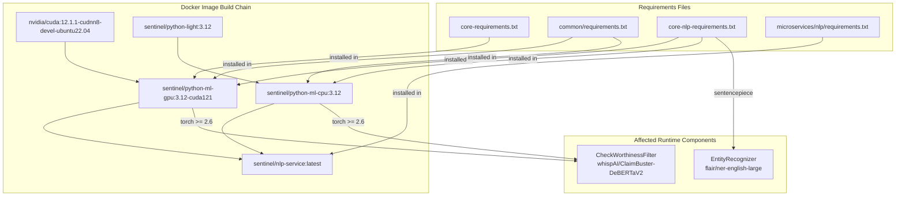

# NLP GPU Container Crash Fix Plan

**Date**: 2026-03-31
**Branch**: `refactor/nlp`
**Status**: Audit complete, ready for execution

---

## Executive Summary

The GPU NLP container (`sentinel-nlp-GPU-service-container`) crashes on startup due to two distinct issues:

1. **FATAL**: Missing `sentencepiece` at runtime despite being listed in `core-nlp-requirements.txt` -- caused by the GPU Dockerfile installing torch BEFORE the requirements file, and torch pulling in an incompatible or cached version of tokenizers/transformers that doesn't pick up `sentencepiece`.
2. **CVE-2025-32434**: `torch.load` vulnerability requiring torch >= 2.6. Current Dockerfiles install torch with no version pin (`pip install torch`), pulling whatever is latest from the PyTorch index. The error suggests the installed version is < 2.6.

---

## Audit Findings

### Issue 1: Missing `sentencepiece` / `tiktoken` -- FATAL CRASH

**Root cause analysis:**

- `sentencepiece>=0.1.99` IS listed in `docker/base/core-nlp-requirements.txt` (line 5).
- `tiktoken` is NOT listed anywhere in any requirements file.
- The error occurs when loading `flair/ner-english-large` (set via `NLP_NER_MODEL` env var in `.env.template` line 86). This model's tokenizer is a "slow" tokenizer that requires `sentencepiece` to be converted to a fast tokenizer.
- The GPU Dockerfile (`docker/base/GPU_ML_base/Dockerfile`) installs torch first (line 26-27), then installs `core-nlp-requirements.txt` (line 35-38). The `sentencepiece` package should be installed by the requirements file, but there may be a build failure or conflict.

**Key discrepancy confirmed from memory**: The env template sets `NLP_NER_MODEL=flair/ner-english-large` but the code default in `config.py` line 20 is `dslim/bert-base-NER-uncased` and in `manager.py` line 84 is `dslim/bert-base-NER`. The `flair/ner-english-large` model specifically needs `sentencepiece` for its DeBERTa-v2-based tokenizer. The `dslim/bert-base-NER` model does NOT need `sentencepiece` (uses standard BERT tokenizer).

**However**, `sentencepiece` IS in the requirements. The real question is: does the GPU base image successfully install it? Possible failure modes:
- The `protobuf` / `sentencepiece` build may fail silently during image build due to missing system-level build dependencies in the CUDA base image (which starts from `nvidia/cuda`, not from `sentinel/python-light` like CPU does).
- The GPU Dockerfile does NOT install `core-requirements.txt` and `common/requirements.txt` in the same `pip install` invocation as CPU -- wait, actually it does (line 35-38). But the CPU Dockerfile installs them in separate steps (lines 6-8, then 10-13, then 18-19).

**Most likely root cause**: The GPU Dockerfile starts from `nvidia/cuda:12.1.1-cudnn8-devel-ubuntu22.04` and only installs Python + pip. It does NOT have the same system dependencies that the CPU image inherits from `sentinel/python-light:3.12`. Building `sentencepiece` from source requires `cmake` and C++ build tools. While `build-essential` is installed (line 10), `cmake` is NOT installed. `sentencepiece` may fail to build its C extension, fall back to a pure-Python stub, and then fail at runtime when tokenizer conversion is attempted.

**Action**: Add `sentencepiece` explicitly with a binary wheel approach, and add `tiktoken` as a secondary fallback (the error message suggests either `sentencepiece` OR `tiktoken` would work).

### Issue 2: torch.load CVE-2025-32434

**Root cause analysis:**

- Both GPU and CPU Dockerfiles install torch with no version pin:
  - GPU: `pip install torch torchvision torchaudio --index-url https://download.pytorch.org/whl/cu121`
  - CPU: `pip install torch torchvision torchaudio --index-url https://download.pytorch.org/whl/cpu`
- The comment in `core-nlp-requirements.txt` line 2 says `# torch>=2.5.1 is done via wget` (outdated -- it's done via pip from PyTorch index).
- CVE-2025-32434 requires torch >= 2.6.0 for safe `torch.load` usage.
- The error is triggered when loading `whispAI/ClaimBuster-DeBERTaV2` which uses the `.bin` (pickle) format, not safetensors.
- Models using safetensors format (DECONTEXT_MODEL, BIAS) loaded fine afterward, confirming the CVE fix only blocks pickle-based loading.

**Affected models (use `torch.load` / pickle format)**:
- `whispAI/ClaimBuster-DeBERTaV2` (CHECKWORTHY) -- confirmed affected
- Potentially any model not distributed in safetensors format

**Affected models (safe, use safetensors)**:
- `google/flan-t5-base` (DECONTEXT_MODEL) -- confirmed safe
- `unitary/toxic-bert` (BIAS) -- confirmed safe

**Action**: Pin torch >= 2.6.0 in both Dockerfiles to resolve the CVE.

---

## Files Requiring Changes

| # | File | Change Type | Purpose |
|---|------|------------|---------|
| 1 | `docker/base/GPU_ML_base/Dockerfile` | Modify | Pin torch >= 2.6.0, ensure `cmake` is installed for `sentencepiece` build |
| 2 | `docker/base/CPU_ML_base/Dockerfile` | Modify | Pin torch >= 2.6.0 |
| 3 | `docker/base/core-nlp-requirements.txt` | Modify | Add `tiktoken` as secondary tokenizer backend, update comment about torch version |

### Files NOT requiring changes (confirmed safe)

- `microservices/nlp/components/ner.py` -- code is correct; the issue is the missing runtime dependency.
- `microservices/nlp/config.py` -- no changes needed.
- `microservices/nlp/Dockerfile` -- service-level Dockerfile is fine; the issue is in the base images.
- `microservices/nlp/requirements.txt` -- service deps are fine.
- `common/model_manager/manager.py` -- loading logic is correct; the torch version is the issue.
- `docker/compose/docker-compose.yml` -- no changes needed.
- `configs/.env.template` -- model names are correct for production use.

---

## Dependency Graph



---

## Risk Assessment

| Risk | Severity | Likelihood | Mitigation |
|------|----------|------------|------------|
| Pinning torch >= 2.6.0 breaks CUDA compatibility with cu121 index | Medium | Unlikely | PyTorch 2.6.x ships cu121 wheels. Verify wheel exists before merge. |
| Adding `cmake` to GPU Dockerfile increases image size | Low | Certain | ~10MB increase; acceptable for build reliability. |
| `tiktoken` conflicts with existing tokenizer versions | Low | Unlikely | `tiktoken` is a lightweight C extension with minimal deps. |
| torch 2.6 changes model loading behavior | Medium | Possible | The CVE fix makes `weights_only=True` the enforced default. Some custom model loading code may need `weights_only=False` explicitly. |
| Rebuilding base images invalidates Docker cache for all downstream images | Low | Certain | Expected; deploy.sh already handles full rebuilds. |

---

## Ordered Execution Plan

### Pre-conditions
- [ ] Verify PyTorch 2.6.x cu121 wheel exists: check https://download.pytorch.org/whl/cu121/ for `torch-2.6.*+cu121` wheels
- [ ] Verify PyTorch 2.6.x CPU wheel exists: check https://download.pytorch.org/whl/cpu/ for `torch-2.6.*` wheels
- [ ] Ensure Docker daemon is accessible for rebuild testing

### Task 1: Pin torch >= 2.6.0 in GPU Dockerfile
**File**: `docker/base/GPU_ML_base/Dockerfile`
**Change**: Line 26-27, modify:
```dockerfile
RUN pip install --no-cache-dir \
    torch torchvision torchaudio --index-url https://download.pytorch.org/whl/cu121
```
to:
```dockerfile
RUN pip install --no-cache-dir \
    "torch>=2.6.0" "torchvision>=0.21.0" "torchaudio>=2.6.0" --index-url https://download.pytorch.org/whl/cu121
```
**Also**: Add `cmake` to the apt-get install line (line 10) to ensure `sentencepiece` C extension can build:
```
software-properties-common ca-certificates curl gnupg build-essential cmake unzip
```
**Dependencies**: None
**Risk**: Medium -- torch version change
**Verification**: `docker build` completes; `python -c "import torch; print(torch.__version__)"` shows >= 2.6.0

### Task 2: Pin torch >= 2.6.0 in CPU Dockerfile
**File**: `docker/base/CPU_ML_base/Dockerfile`
**Change**: Lines 6-7, modify:
```dockerfile
RUN pip install --no-cache-dir \
    torch torchvision torchaudio --index-url https://download.pytorch.org/whl/cpu
```
to:
```dockerfile
RUN pip install --no-cache-dir \
    "torch>=2.6.0" "torchvision>=0.21.0" "torchaudio>=2.6.0" --index-url https://download.pytorch.org/whl/cpu
```
**Dependencies**: None (can run in parallel with Task 1)
**Risk**: Medium -- torch version change
**Verification**: `docker build` completes; `python -c "import torch; print(torch.__version__)"` shows >= 2.6.0

### Task 3: Add tiktoken to core-nlp-requirements.txt
**File**: `docker/base/core-nlp-requirements.txt`
**Change**: Add `tiktoken>=0.7.0` after `sentencepiece` line, and update the torch comment:
```
# NLP Backbone
# torch>=2.6.0 is installed via pip in base Dockerfiles (GPU_ML_base, CPU_ML_base)
transformers>=4.43.4
accelerate>=0.26.0
sentencepiece>=0.1.99
tiktoken>=0.7.0
protobuf>=3.20.0
numpy>=1.26.4
```
**Dependencies**: None (can run in parallel with Tasks 1-2)
**Risk**: Low -- additive dependency
**Verification**: `pip install tiktoken` succeeds; `python -c "import tiktoken"` works

### Task 4: Rebuild and Test
**Dependencies**: Tasks 1, 2, 3 must all be complete
**Steps**:
1. Rebuild GPU base image: `docker build -t sentinel/python-ml-gpu:3.12-cuda121 -f docker/base/GPU_ML_base/Dockerfile .`
2. Rebuild CPU base image: `docker build -t sentinel/python-ml-cpu:3.12 -f docker/base/CPU_ML_base/Dockerfile .`
3. Rebuild NLP service image: `docker compose build nlp-service-gpu` (or use `deploy.sh`)
4. Run the NLP GPU container and verify:
   - No `torch.load` CVE error on `whispAI/ClaimBuster-DeBERTaV2` loading
   - No `sentencepiece` / `tiktoken` error on `flair/ner-english-large` tokenizer loading
   - All 7 registered models load successfully
5. Run the NLP CPU container similarly to confirm no regression

### Task 5: Run existing tests
**Dependencies**: Task 4
**Steps**:
```bash
pytest tests/ -v
```
Specifically watch for failures in tests that touch NLP components.

---

## Rollback Plan

If the changes cause new issues:

1. **Revert torch pin**: Remove version constraints from Dockerfiles, reverting to unpinned `torch torchvision torchaudio`.
2. **Revert tiktoken**: Remove `tiktoken` line from `core-nlp-requirements.txt`.
3. **Revert cmake**: Remove `cmake` from GPU Dockerfile apt-get line.
4. **Rebuild all images**: Run `./scripts/deploy.sh base` to rebuild from scratch.

The rollback returns to the current broken state but does not introduce new breakage. The pre-existing crash would remain.

---

## Additional Notes

### Model/Code Default Discrepancy (pre-existing, not caused by this fix)
The `.env.template` specifies `NLP_NER_MODEL=flair/ner-english-large` while the code defaults are `dslim/bert-base-NER-uncased` (config.py) and `dslim/bert-base-NER` (manager.py). The `flair/ner-english-large` model is what triggers the `sentencepiece` requirement. If the env var is not set, the code defaults would work fine without `sentencepiece` since `dslim/bert-base-NER` uses a standard BERT tokenizer. This fix ensures both paths work.

### EntityRecognizer bypasses ModelManager
The `EntityRecognizer` in `ner.py` loads its model directly via `AutoTokenizer.from_pretrained` and `AutoModelForTokenClassification.from_pretrained` (lines 30-36) instead of going through the centralized `ModelManager`. The `ModelManager` also registers an NER model entry (key `"NER"` in manager.py line 82-93) but uses a different default (`dslim/bert-base-NER`). This dual-loading path is a pre-existing architectural issue that should be addressed separately.

### GPU Dockerfile vs CPU Dockerfile structural difference
The GPU Dockerfile starts from `nvidia/cuda` (bare Ubuntu) and installs Python from deadsnakes PPA. The CPU Dockerfile starts from `sentinel/python-light:3.12` which already has Python configured. This means the GPU image may be missing system libraries that the CPU image inherits. Adding `cmake` to the GPU Dockerfile addresses one gap, but there may be others.
